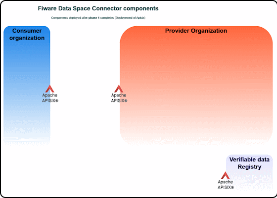

# Apisix
- [Apisix](#apisix)
  - [step01: _Deploy a basic version of a helloWorld chart_](#step01-deploy-a-basic-version-of-a-helloworld-chart)
  - [step02: Deploy a functional version of apisix](#step02-deploy-a-functional-version-of-apisix)
  - [step03: Deploy a new route via the apisix-routes.yaml file](#step03-deploy-a-new-route-via-the-apisixyaml-file)
  - [step04: Use Admin API to manage routes](#step04-use-admin-api-to-manage-routes)
  - [Bottom line](#bottom-line)

[Apache APISIX](https://apisix.apache.org/) provides rich traffic management features like extension via plugins, Load Balancing, Dynamic Upstream, Canary Release, Circuit Breaking, Authentication, Observability, etc.


The following steps are focused on the deployment of the Helm Chart of Apisix to install an instance of this open source Apache API Gateway. At this HOL, Apisix will be used by all the  Fiware Data space parties and it will be installed in a devoted namespace named `apisix`.

## step01: _Deploy a basic version of a helloWorld chart_
```shell
# To show the structure of the github after the completion of this step
git checkout phase01.step01
kubectl create namespace apisix
```
This step uses the components at the apisix Chart; it deploys a basic version of a _helloWorld_ chart (included inside the apisix Helm Chart)
1. Decide the DNS to expose the consumer apisix proxy (Local or global DNS)
   eg. fiwaredsc-consumer.local, fiwaredsc-consumer.ita.es, ...
2. For Local DNS register them as root at the '/etc/hosts' file (ubuntu) and/or 'C:\Windows\System32\drivers\etc\hosts' file (windows)
    ```shell
    ...
    <HOSTIP_ADDRESS>  fiwaredsc-consumer.local
    ```

3. Create the TLS Certificate  
    a) For local DNSs, generating not trusted certificates just for testing:
    ```shell
    mkdir -p Helms/apisix/.certs
    openssl req -x509 -nodes -days 365 -newkey rsa:2048 -keyout Helms/apisix/.certs/tls-wildcard.key -out Helms/apisix/.certs/tls-wildcard.crt -subj "/CN=*.local"
    ```
    b) For global DNS, using your organization official certificates (issued by Certification authority companies such as Let’s encrypt, ZeroSSL, …).  
    For every public TLS/SSL certificate, CAs must verify, at a minimum, the requestors' domain.e.g. Let’s encrypt.  
4. This guideline uses local DNS, so a testing certificate is used.  
   Create the TLS k8s secret generic based on the previously created certificate. Name it _wildcardlocal-tls_ and ensure the value files refers to this secret at the _utils.echo.ingress.tls.secretName_
  ```shell
  kubectl create secret tls wildcardlocal-tls -n apisix --key Helms/apisix/.certs/tls-wildcard.key --cert Helms/apisix/.certs/tls-wildcard.crt
  ```

1. Customize the [Apisix values file](../../Helms/apisix/values.yaml)  
For example, you can start enabling just the utils components activating the enabled flags for utils and deactivating it for the Apisix component:  
    ```yaml
    utils:
      enabled: true
      echo:
        enabled: true
        ingress: 
          enabled: true
    ...
    apisix:
      enabled: false
    ```
1. Deploy the helm
    ```shell
    hFileCommand apisix install -b
    # Will execute helm command: helm -n apisix install -f "./Helms/apisix/values.yaml" apisix "./Helms/apisix/"  --create-namespace
    ```
2. Test it. Does it work?
    ```shell
    curl https://fiwaredsc-consumer.local # It should fail
    curl -k https://fiwaredsc-consumer.local # It should work
      Hostname: echo-767d576b65-t84j4
      Pod Information:
      node name:      v23040
      pod name:       echo-767d576b65-t84j4
      ...
    ```
At this stage, we know that we have a kubernetes cluster with the ingress working properly and the helm tool doing a great job.  

```shell
# To show the structure of the github after the completion of the next step
git checkout phase01.step02
```
## step02: Deploy a functional version of apisix  
```shell
# To show the structure of the github after the completion of this step
git checkout phase01.step02
# NOTE to avoid refering to the namespace apisix at each command, the ENV VAR DEF_KTOOLS_NAMESPACE=apisix is set:
export DEF_KTOOLS_NAMESPACE=apisix
```
At this step, we will setup the apisix to serve as the official gateway of the HOL in which the different routes that have to be exposed on the internet will be registered. At this stage statically, but later dinamically.

1. Modify the values file (Helms/apisix/values.yaml) to enable apisix and disable the util's ingress.
2. Deploy the changes
    ```shell
    hFileCommand apisix restart
    # Running CMD=[helm -n apisix install -f "./Helms/apisix/values.yaml" apisix "./Helms/apisix/"  --create-namespace]
    ```
3. After some seconds the deployments should be running
    ```shell
    kGet 
    #   Running command [kubectl get pod  -n apisix]
    ---
    NAME                                         READY   STATUS    RESTARTS   AGE
    apisix-control-plane-7ffd9fdc4c-2jpw5        1/1     Running   0          5h23m
    apisix-dashboard-78d68bf7c5-cmb28            1/1     Running   0          5h23m
    apisix-data-plane-8488664577-4t7lg           1/1     Running   0          5h23m
    apisix-etcd-0                                1/1     Running   0          5h23m
    apisix-ingress-controller-5b8f85878d-vpggm   1/1     Running   0          5h23m
    echo-588c888c78-r2d7d                        1/1     Running   0          5h23m
    netutils-65cd7b88b8-fwn5h                    1/1     Running   0          5h23m
    ```
4. Test it. Does it work? It should
    ```shell
    curl -k https://fiwaredsc-consumer.local
    ```
The changes that introduce the use of the Apisix in order to define new routes are two:
1. The ingress section of the data plane at the apisix values file contains the ingress configuration: DNSs, TLSs, ...  
For this initial use, just one DNS and one TLS secret are required:
    ```yaml
    apisix:
      ...
      ingress:
        enabled: true
        hostname: fiwaredsc-consumer.local
        tls: true
        extraTls:
          - hosts: [fiwaredsc-consumer.local]
            secretName: wildcard_local-tls
      ...
    ```

2. The route `https://fiwaredsc-consumer.local` has been defined at the [apisix-routes.yaml file](https://github.com/cgonzalezITA/DSFiware-hackathon/blob/phase01.step02/Helms/apisix/apisix-routes.yaml).
This file is used to statically specify the routes the Apisix gateway will manage.
```shell
cat Helms/apisix/apisix-routes.yaml
  routes:
  - 
    uri: /*
    host: fiwaredsc-consumer.local
    methods: 
      - GET    
    upstream:
      type: roundrobin
      nodes:
        echo-svc:8080: 1
  ...
```

```shell
# To show the structure of the github after the completion of the next step
git checkout phase01.step03
```
## step03: Deploy a new route via the apisix-routes.yaml file
```shell
# To show the structure of the github after the completion of this step
git checkout phase01.step03
# NOTE to avoid refering to the namespace apisix at each command, the ENV VAR DEF_KTOOLS_NAMESPACE=apisix is set:
export DEF_KTOOLS_NAMESPACE=apisix
```
As you have seen, there is a dashboard component deployed, but just one DNS managed by the Apisix ingress. This step will modify the [apisix-routes.yaml file](https://github.com/cgonzalezITA/DSFiware-hackathon/blob/phase01.step03/Helms/apisix/apisix-routes.yaml) to include a new route to expose the dashboard to be consumed via browser.
1. Decide the DNS to expose the Apisix dashboard (Local or global DNS)
eg. fiwaredsc-api6dashboard.local ...
2. For Local DNS register it at the /etc/hosts (ubuntu) and/or C:\Windows\System32\drivers\etc\hosts (windows)
    ```shell
    ...
    <HOSTIP_ADDRESS>  fiwaredsc-api6dashboard.local
    ```

4. Modify the apisix values file to manage the new DNS and the TLS certificate:
    ```yaml
    apisix:
      ...
      ingress:
        enabled: true
        hostname: fiwaredsc-consumer.local
        tls: true
        extraHosts:
          - name: fiwaredsc-api6dashboard.local
            path: /
        extraTls:
          - hosts: [fiwaredsc-consumer.local, fiwaredsc-api6dashboard.local]
            secretName: wildcard_local-tls
      ...
    ```
5. Modify the [apisix-routes.yaml file](https://github.com/cgonzalezITA/DSFiware-hackathon/blob/phase01.step03/Helms/apisix/apisix-routes.yaml) to add the route for the Apisi dashboard:
      ```yaml
      routes:
      - 
        uri: /*
        host: fiwaredsc-api6dashboard.local
        methods: 
          - GET    
          - POST
          - PUT
          - HEAD
          - CONNECT
          - OPTIONS
          - PATCH
          - DELETE
        upstream:
          type: roundrobin
          nodes:
            apisix-dashboard:80: 1
      #END
      ```
6. Redeploy the helm chart:
    ```shell
    hFileCommand api upgrade
    # Running CMD=[helm -n apisix upgrade -f "./Helms/apisix/./values.yaml" apisix "./Helms/apisix/./"  --create-namespace]
    Release "apisix" has been upgraded. Happy Helming!
    ```
7. Test it. It should work.
    ```shell
    curl -k https://fiwaredsc-api6dashboard.local
    ```
    <p style="text-align:center;font-style:italic;font-size: 75%"><br/>
    APISIX Dashboard</p>
8. To login, you need to retrieve the apisix Dashboard password.  
If you visit the values file, the secret and the key used to store the dashboard user's password are defined:
    ```yaml
    apisix:
      dashboard:
        ...
        existingSecret: apisix-dashboard-secrets
        existingSecretPasswordKey: apisix-dashboard-secret
        ...
    ```
    So, use kubectl command to retrieve the password:  
    ```shell
    kSecret-show -n api dashboard-secrets -f apisix-dashboard-secret -v
    # Running CMD=[kubectl get -n apisix secrets apisix-dashboard-secrets -o jsonpath='{.data.apisix-dashboard-secret}' | base64 -d]
    ```
    <p style="text-align:center;font-style:italic;font-size: 75%"><br/>
    APISIX Routes</p>

```shell
# To show the structure of the github after the completion of the next step
git checkout phase01.step04
```
## step04: Use Admin API to manage routes
```shell
# To show the structure of the github after the completion of this step
git checkout phase01.step04
```

Instead of modifying the apisix-routes.yaml file, routes can also be managed via Admin API (the deployment **Apisix-control-plane** exposes the endpoints to manage them) or via the dashboard web interface shown  at the previous Step.  
In this step, using one of the provided [_manageAPI6Routes.ypynb_](../../scripts/manageAPI6Routes.ipynb) or [_manageAPI6Routes.sh_](../../scripts/manageAPI6Routes.sh) files, recreate the route /hello using the Admin API. These scripts are at the [/scripts folder](../../scripts/):  
This guideline will use the script file, but the Jupyter file can be customized to run the same actions.

1. Modify the data-plane deployment's configuration to change the config_provider:
    ```yaml
    dataPlane:
      ingress:
        ...
        extraConfig:
          # https://apisix.apache.org/docs/apisix/deployment-modes/
          deployment:
            role_data_plane:
            #   # Decoupled
            #   # In the decoupled deployment mode the data_plane and control_plane instances of APISIX are deployed 
            #   # separately, i.e., one instance of APISIX is configured to be a data plane and the other to be a control plane.
              config_provider: etcd
    ```
2. Upgrade the apisix helm chart
    ```shell
    hFileCommand apisix upgrade
    # Wait till the pods have been properly deployed
    kGet -n api -w
    ...
    ```

3. Analyze the [_manageAPI6Routes.sh_](../../scripts/manageAPI6Routes.sh) file to recreate the route /hello using the Admin API. Inside the file, a number of ENVVARS will define the routes as they should be registered. Study and use the _manageAPI6Routes.sh_ script:
```shell
manageAPI6Routes.sh -h
  HELP: USAGE: scripts/manageAPI6Routes.sh [optArgs] <ACTION> 
          -h: Show help info 
          [ -r | --route ] <ROUTE>: Mandatory for insert and update. ENVVAR NAME of the route to execute the action on. It has to be defined inside this script 
          [ -rid | --routeId ] <ROUTE_ID>: Mandatory for delete and update
          <ACTION>: One of [ info | list | insert* | delete | update ]

# To see the available routes defined at the script
manageAPI6Routes.sh info
    # Info of routes available at this script:
    ROUTES=[ROUTE_API6DASHBOARD_JSON
    ROUTE_DEMO_JSON
    ...]

# Insert api6 route ROUTE_DEMO_JSON
manageAPI6Routes.sh insert -r ROUTE_DEMO_JSON
    HTTP/1.1 201 Created
    {"key":"/apisix/routes/00000000000000000035","value":{"id":"00000000000000000035","methods":["GET"],"name":"hello",...}

# Insert api6 route ROUTE_API6DASHBOARD_JSON
manageAPI6Routes.sh insert -r ROUTE_API6DASHBOARD_JSON

# Get list of api6 routes
manageAPI6Routes.sh list
    {"total":2,"list":[{"key":"/apisix/routes/00000000000000000035","value":{"id":"00000000000000000035","methods":["GET"],"name":"hello"
    ...
```

4. Visit the https://fiwaredsc-api6dashboard.local at the browser to view the new routes.
   <p style="text-align:center;font-style:italic;font-size: 75%"><br/>
    APISIX Routes</p>

5. Test the /hello route. Does it work? Now, it should.
    ```shell
    curl -k https://fiwaredsc-consumer.local
    ```

```shell
# To show the structure of the github after the completion of the next step
git checkout phase02.step01
```

## Bottom line
Once the apisix helm chart is fully deployed, the Fiware Data Space future architecture deployed looks like:
   <p style="text-align:center;font-style:italic;font-size: 75%"><br/>
    Deployed architecture after phase 1 completed</p>

Following phases will add components to each one of the Data Space blocks.

**NOTE**: Next phase is [Deployment of the Verifiable Data Registry components (Trust-Anchor)](./README-trustAnchor.md)
