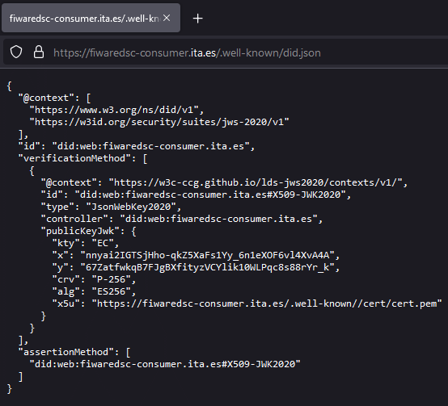
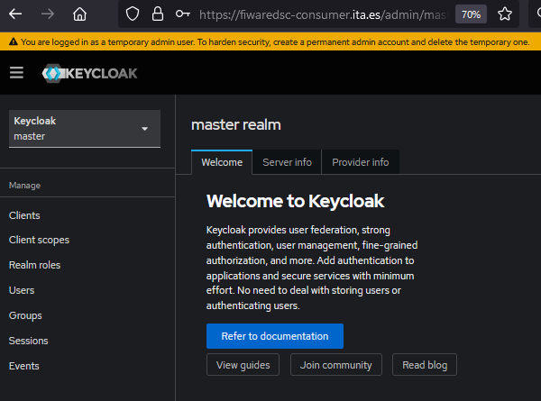
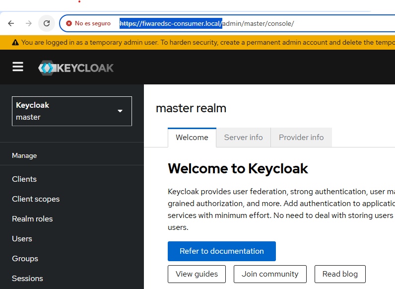
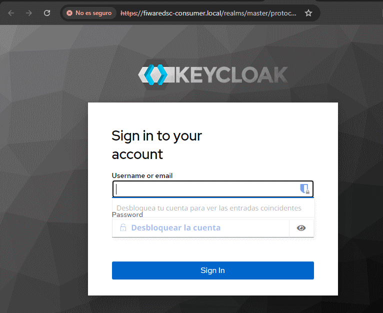
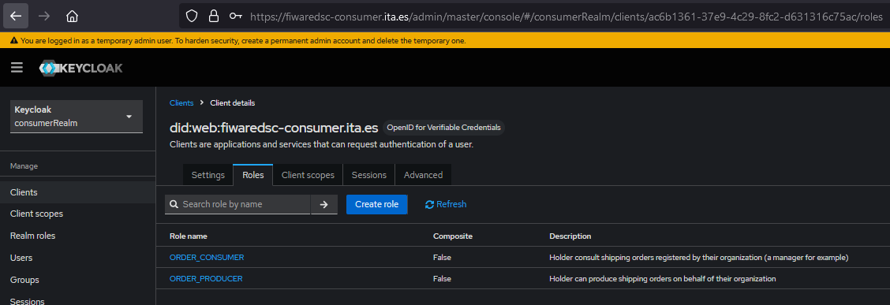
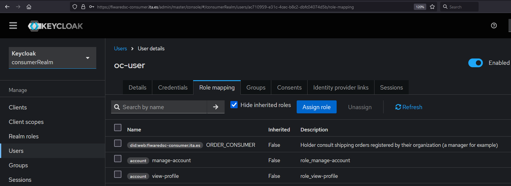
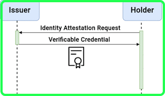
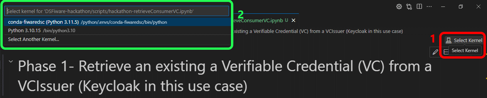
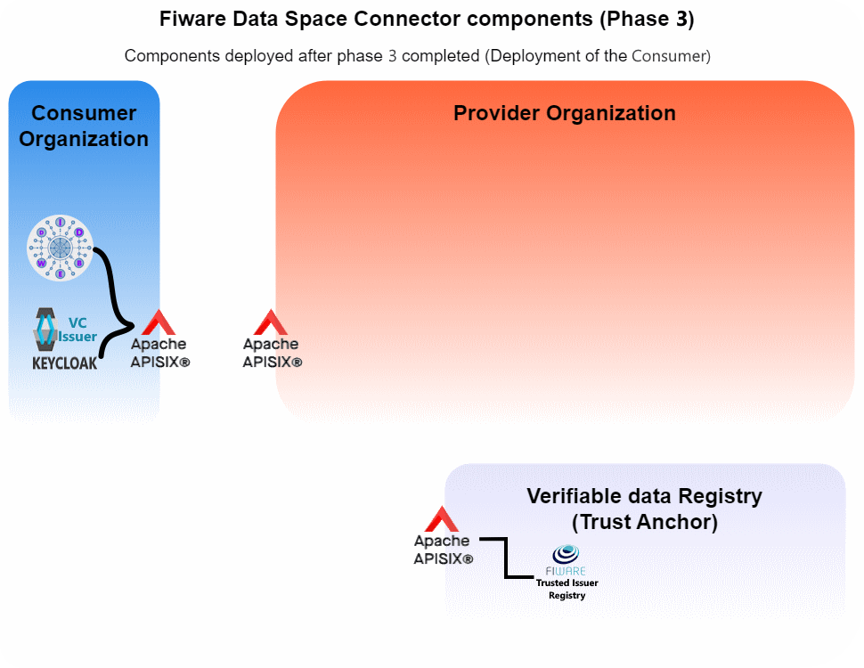

# Consumer's infrastructure
- [Consumer's infrastructure](#consumers-infrastructure)
  - [Decentralized Identifiers](#decentralized-identifiers)
  - [Verifiable Credentials](#verifiable-credentials)
    - [Usage and actors around a VC](#usage-and-actors-around-a-vc)
    - [Benefits of Using DIDs with VCs](#benefits-of-using-dids-with-vcs)
  - [Infrastructure](#infrastructure)
  - [step01: _Deployment of the DID:key and DID:web_](#step01-deployment-of-the-didkey-and-didweb)
    - [values-did.key.yaml](#values-didkeyyaml)
    - [values-did.web.yaml](#values-didwebyaml)
    - [Verification](#verification)
      - [values.did.key.yaml](#valuesdidkeyyaml)
      - [values.did.web.yaml](#valuesdidwebyaml)
  - [step01.web: Publication of the did:web VCIssuer routes](#step01web-publication-of-the-didweb-vcissuer-routes)
  - [step01.key: Publication of the did:key VCIssuer route](#step01key-publication-of-the-didkey-vcissuer-route)
  - [_step02.web-Deployment of the VCIssuer (Keycloak)_](#step02web-deployment-of-the-vcissuer-keycloak)
    - [Verification](#verification-1)
  - [_step02.key-Deployment of the VCIssuer (Keycloak)_](#step02key-deployment-of-the-vcissuer-keycloak)
    - [Verification](#verification-2)
  - [step03-First access to the Keycloak route](#step03-first-access-to-the-keycloak-route)
    - [Roles](#roles)
    - [Users Registered](#users-registered)
  - [step04-Issuance of VCs](#step04-issuance-of-vcs)
    - [Issue VCs through a M2M flow (Using API Rest calls)](#issue-vcs-through-a-m2m-flow-using-api-rest-calls)
    - [Issue VCs for a H2M interaction using a browser](#issue-vcs-for-a-h2m-interaction-using-a-browser)
  - [Bottom line](#bottom-line)

Any participant willing to consume services offered at the data space is required to count on a minimum infrastructure to enable the management of its **Verifiable Credentials (VCs)** and a **Decentralized Identifier (DID)** that will be its identity used to sign any VC request issued by it.  
This section describes the components and the steps deploy a consumer's infrastructure. The step number is duplicated given that they focus on the use of a DID web or a DID key as explained below.

## Decentralized Identifiers
**Decentralized Identifiers (DIDs)** are a type of digital identifier designed to give users control over their own digital identities. Unlike traditional identifiers like email addresses or usernames, DIDs are decentralized and do not rely on a centralized authority for creation or verification.

Each DID includes a method, defining how it’s created and managed. Here’s an overview of the two DID methods used in this deployment, `did:web` and `did:key`. More dids can be seen at the [DIF Universal Resolver site](https://dev.uniresolver.io/). This site also enables the verification of compliance of your own DIDs.  
All the DIDs used at this repository conform to the [W3C DID Spec v1.0](https://www.w3.org/TR/did-core/):

1. **DID:web**
   - They provide a DID that can be resolved using the traditional Domain Name System (DNS).
   - **Structure**: `did:web:fiwaredsc-consumer.ita.es` where `fiwaredsc-consumer.ita.es` is the domain hosting the DID document.
   - **Usage**: Used to sign any message exchanged with the data space, although out of the context of a Data Space, it can also be used to leverage their existing web infrastructure to host and verify DID documents.
   - **Resolution**: The DID document is hosted at a well known URL of the organization (e.g. `https://fiwaredsc-consumer.ita.es/.well-known/did.json`)
   
2. **DID:key**
   - They provide a self-contained, cryptographic DID that requires no external hosting.
   - **Structure**: `did:key:z6Mk...`, where the key identifier represents a public key encoded directly in the DID.
   - **Usage**: Suitable for quick, ephemeral identities or offline situations, where persistence or external verification isn’t needed.
   - **Resolution**: The DID itself encodes a public key, which can be used directly to derive a DID document.
   - is self-contained, suitable for temporary or cryptographic identities without external dependencies.
  eg: _did:key:zDnaefiViQT7nRiujV81dnHewLudJiqLVbp4PfyvovMxR89Ww_

## Verifiable Credentials
**Verifiable Credentials (VCs)** are tamper-evident digital claims that verify information about a person, organization, or asset, and they rely on **Decentralized Identifiers (DIDs)** for issuer and holder identification. Together, VCs and DIDs form a foundational system for decentralized identity and trust on the internet.

### Usage and actors around a VC
In the use of a VC is very well described at this image: 
   <p style="text-align:center;font-style:italic;font-size: 75%"><br/>VC Usage and Actors around them</p>
    
The roles of the actors related with the usage of a VC are:
1. **Issuance**:
   - An **VCIssuer** in the context of the Data Space is any organization taking part of it, both data consumer and data providers. Its role is to issue VCs. These VCs contain a number of claims related with the VC Holder. A Holder can be a Human (Eg. _The Issuer claims that a Person is named Paul and that its role inside an organization is the role of [LEAR](https://eufunds.me/what-is-a-lear-legal-entity-appointed-representative/#:~:text=A%20LEAR%20is%20a%20Legal%20Entity%20Appointed%20Representative.))_
   - The issuer signs the VC using its DID, which proves the authenticity of the credential without depending on a centralized authority. The DID serves as a unique identifier that can be verified against a DID document containing the public key and verification methods so any verifier can check the authenticity of the VCs.

2. The **holder** of the VC (e.g., an employee of an organization) receives and stores the credential, often in a [digital wallet app](https://ec.europa.eu/digital-building-blocks/sites/display/EUDIGITALIDENTITYWALLET/EU+Digital+Identity+Wallet+Home) or a Digital Vault. This credential is bound to its organization DID.
   - The holder can present this VC to any third party (a **verifier**) when it is required to verify the authenticity of a claim (e.g., _that it is the LEAR of an organization_).

3. - A **verifier** (e.g., a data provider willing to verify the identity of the requestor of a service) receives the VC from the holder and verifies its authenticity by checking the issuer’s DID and signature.
   - The verifier can confirm both that the issuer is legitimate (by looking up the DID document for the issuer) and that the VC has not been tampered, thanks to the cryptographic signature.

### Benefits of Using DIDs with VCs
- **Decentralization**: DIDs eliminate the need for a central authority, making identity verification more privacy-respecting and resilient.
- **Control and Privacy**: Holders have control over which VCs to share and with whom, which reduces unnecessary exposure of personal data. Besides, using protocols such as the [SD-JWT VC](https://drafts.oauth.net/oauth-sd-jwt-vc/draft-ietf-oauth-sd-jwt-vc.html#name-sd-jwt-as-a-credential-form) just some of the fields of a VC can be set as readable by a Verifier.
- **Interoperability**: VCs and DIDs are based on open standards, enabling them to work across different systems and applications.


To extend the knowledge of these concepts, the web offers a handful set of resources, some of them:
- [decentralized_IAM by Stefan Wiedemann](https://github.com/wistefan/presentations/blob/main/data-spaces-onboarding/decentralized-trust-and-iam/decentralized_IAM.pdf).
- [Verifiable Credentials: The Ultimate Guide 2024](https://www.dock.io/post/verifiable-credentials).
- [SD-JWT VC](https://drafts.oauth.net/oauth-sd-jwt-vc/draft-ietf-oauth-sd-jwt-vc.html#name-sd-jwt-as-a-credential-form).
- ...

In this phase, setups to deploy both did: `did:key` and `did:web` are shown.  
The use of a did:web implies the control of a public DNS to publicly expose the well known did:web endpoint for being consumer by any 'verifier' and mainly to route cloud requests to the server bound to the did:web DNS.   
_eg. to use the `did:web:fiwaredsc-consumer.ita.es`, The [Instituto Tecnológico de Aragón (ITA)](https://www.ita.es/) owner of the `ita.es` domain, must redirect web requests made to https://fiwaredsc-consumer.ita.es to the server in which the DID details is shown at the well known endpoint `https://fiwaredsc-consumer.ita.es/.well-known/did.json`_


## Infrastructure
The following steps describe the different components to be deployed:
- **Decentralized Identity (DID)**. Steps to deploy both, did:web and did:key will be explained. Two value files are at this Helm chart with the configuration to deploy both dids.
- **Verifiable Credential Issuer**. Values to deploy a functional Keycloak are explained.
- **Registration mechanism**. This component contains the steps to register a Consumer inside a data space. It does not follow the steps described at the [_Onboarding of an organization in the data space_](https://github.com/FIWARE/data-space-connector?tab=readme-ov-file#onboarding-of-an-organization-in-the-data-space) as it is tailored for demo scenarios and because the interactions with the [GaiaX Clearing Houses (GXDCH)](https://gaia-x.eu/gxdch/) have to be yet fully polished (at the moment this guideline was written).  
Ths registration is not explained nor deployed at this phase as it requires the whole data space to be in place. It will be explained later at the [initial set up the DS infrastructure](README-initialSetUpOfTheDS.md) phase.
  
## step01: _Deployment of the DID:key and DID:web_ 
```shell
# To show the structure of the github after the completion of this  step
git checkout phase03.step01
```
The consumer Helm Chart provides two value files. One to deploy the DID:key component and another to deploy the DID:web one. To deploy the DID:key run:
At this first step, only the utils and the did are enabled to trace potential problems.
### values-did.key.yaml
```yaml
utils:
  enabled: true
  echo:
    enabled: false

# -- configuration for the did-helper, should only be used for demonstrational deployments, 
# see https://github.com/wistefan/did-helper
did:
  enabled: true
  type: key
  port: 3000
  pfx:
    secretName: did-secret
    secretKeyField: store-pass
  cert:
    country: es
    state: ES-AR
    locality: Zaragoza
    organization: ITA
    commonName: www.ita.es
  ingress:
    enabled: false
    host: fiwaredsc-consumer-did.ita.es
```

### values-did.web.yaml
```yaml
utils:
  enabled: true
  echo:
    enabled: false

# -- configuration for the did-helper, should only be used for demonstrational deployments, 
# see https://hub.docker.com/repository/docker/itainnovaprojects/ita-didweb-generator/general
did:
  enabled: true
  type: web
  port: 3000
  pfx:
    fileName: cert.pfx
    alias: ita.es
    secretName: did-secret
    secretKeyField: store-pass
  serviceType: ClusterIP
  baseURL: https://fiwaredsc-consumer.ita.es
  outputFolder: /cert
  cert:
    country: es
    state: ES-AR
    locality: Zaragoza
    organization: ITA
    commonName: www.ita.es
    organizationunit: it
  ingress:
    enabled: false
    host: fiwaredsc-consumer.ita.es
```
**NOTE**: Pay attention that at this moment, the dns used is not a _.local_ one, but a real DNS managed by the ITA organization as explained before.

To deploy the consumer charts just run for the did:key:
```shell
hFileCommand consumer -f key -b
# Running CMD=[helm -n consumer install -f "./Helms/consumer/values-did.key.yaml" consumer "./Helms/consumer/"  --create-namespace]
```
To deploy the consumer charts just run for the did:web:
```shell
hFileCommand consumer -f web
# Running CMD=[helm -n consumer install -f "./Helms/consumer/values-did.web.yaml" consumer "./Helms/consumer/"  --create-namespace]
```

### Verification
After the components have been deployed, they can be tested running the following commands:
#### values.did.key.yaml
If this file is used to generate the k8s artifacts:
```shell
# Change the default working namespace:
export DEF_KTOOLS_NAMESPACE=consumer

# Check the value of the DID:
kExec net -n $NAMESPACE -- curl -s http://did:3000/did-material/did.env
    Running command [kubectl exec -it -n consumer utils-nettools-8554c96795-pbx9z  --  curl http://did:3000/did-material/did.env]
    DID=did:key:zDnaeg4A7Qaic1XbFpX98Dqk4TexNpXShMynW6po8Mnksn3s9

# Get the cert.pfx file and analyze it:
kExec utils-nettools -n consumer -- wget http://did:3000/did-material/cert.pfx
    ...
    HTTP request sent, awaiting response... 200 OK
    Length: 1323 (1.3K)
    Saving to: ‘cert.pfx.2’
    ...

# Retrieve the cert.pfx
NETUTILSPOD=$(kGet utils-nettools -v -o yaml | yq eval '.metadata.name' -)
kubectl -n consumer cp $NETUTILSPOD:cert.pfx cert.pfx

# Next command keytool will ask for a password that can be retrieved from secret did-secret:
kSecret-show did -f store-pass -v -y
# Analyze the certificate
keytool -list -v -keystore cert.pfx -storetype PKCS12
    Enter keystore password:  
    Keystore type: PKCS12
    Keystore provider: SUN

    Your keystore contains 1 entry

    Alias name: didprivatekey
    Creation date: Nov 14, 2024
    Entry type: PrivateKeyEntry
    Certificate chain length: 1
    Certificate[1]:
    Owner: CN=www.ita.es, O=ITA, L=Zaragoza, ST=ES-AR, C=es
    Issuer: CN=www.ita.es, O=ITA, L=Zaragoza, ST=ES-AR, C=es
    ...
# rm cert.pfx
```
This previous verification is highly sensitive, so protect this kind of actions at your production k8s cluster; eg. using _KubeArmorPolicies_.

#### values.did.web.yaml
If this file is used to generate the k8s artifacts, the commands are the same, although the output will differ:
```shell
# Change the default working namespace:
export DEF_KTOOLS_NAMESPACE=consumer

# Check the value of the DID:
kExec net -v -- curl http://did:3000/did-material/did.env
    DID=did:web:fiwaredsc-consumer.ita.es

# Get the cert.pfx file and analyze it:
...
```
This previous verification is highly sensitive, so protect this kind of actions at your production k8s cluster; eg. using _KubeArmorPolicies_.

```shell
# To show the structure of the github after the completion of the next step
git checkout phase03.step02-key
```

## step01.web: Publication of the did:web VCIssuer routes
As explained before, one of the requirements of the did:web DIDs is that they must be accessible from the internet at the well known endpoint `/.well-known/did.json`. To setup a new route to access this json document it is mandatory to have the control of the chosen DNS having its certificates (these certificates will have to be signed by a Certification Authority (CA)):
1. Create a tls secret containing the certificate files. Customize the following commands according to your organization methodology to manage certificates.
      ```shell
      # Creates the tls certificate at the apisix namespace to manage the *.ita.es tls.
      kubectl create secret tls wildcard-ita.es-tls -n apisix --key /certificates/<organization>/privkey.pem --cert /certificates/<organization>/fullchain.pem
      # Creates the tls certificate at the consumer namespace to manage the *.ita.es tls.
      kubectl create secret tls wildcard-ita.es-tls -n consumer --key /certificates/<organization>/privkey.pem --cert /certificates/<organization>/fullchain.pem
      ```
      
2. Modify the Apisix to manage a new DNS (`fiwaredsc-consumer.ita.es`) using the tls `wildcard-ita.es-tls` and upgrade the Apisix Helm chart and enable the keycloack component at the [values-did.web.yaml](../../Helms/consumer/values-did.web.yaml).
      ```script
      hFileCommand consumer -y restart -v -f web -b
      ```

3. Once deployed, new routes must be registered to expose:
- The well known did.json document at the endpoint `https://fiwaredsc-consumer.ita.es/.well-known/did.json`
- The endpoint to access the VCIssuer. `https://fiwaredsc-consumer.ita.es`,  `https://fiwaredsc-consumer.ita.es/realms/consumerRealm/oid4vci`...  
  This VCIssuer role implies that it exposes the OIDC well known endpoing. `https://fiwaredsc-consumer.ita.es/realms/consumerRealm/.well-known/openid-configuration`

    ```script
    # Remove the previously used route ROUTE_DEMO_JSON
    . scripts/manageAPI6Routes.sh delete -r ROUTE_DEMO_JSON

    # Registers the Well known did.json document
    . scripts/manageAPI6Routes.sh insert -r ROUTE_WELLKNOWN_DID_WEB_fiwaredsc_consumer_ita_es

    # Register the VCIssuer endpoints
    . scripts/manageAPI6Routes.sh insert -r ROUTE_CONSUMER_KEYCLOAK_fiwaredsc_consumer_ita_es
    ```

To test it is working, browse this URL `https://fiwaredsc-consumer.ita.es`:
<p style="text-align:center;font-style:italic;font-size: 75%"><br/>
    did-web.json exposed at a well known URL</p>

## step01.key: Publication of the did:key VCIssuer route
Unlike the did:web deployment, this did:key does not require the exposition of any global DNS, so a local DNS will be used instead. In previous examples, the DNS was linked to a demo service, but now it will be linked to the consumer VCIssuer, the `fiwaredns-consumer.local`, so no new secret will have to be registered.
      
1. Modify the Apisix routes to reassign the already used DNS (`fiwaredns-consumer.local`) to expose:
- The endpoint to access the VCIssuer. `https://fiwaredsc-consumer.local`,  `https://fiwaredsc-consumer.local/realms/consumerRealm/oid4vci`...  
  This VCIssuer role implies that it exposes the OIDC well known endpoing. `https://fiwaredsc-consumer.local/realms/consumerRealm/.well-known/openid-configuration`

    ```script
    # Remove the previously used route ROUTE_DEMO_JSON
    . scripts/manageAPI6Routes.sh delete -r ROUTE_DEMO_JSON

    # Register the VCIssuer endpoint
    . scripts/manageAPI6Routes.sh insert -r ROUTE_CONSUMER_KEYCLOAK_fiwaredsc_consumer_local
    ```
2. As it is a locally managed DNS, remember to register it at the environments from where the local DNS will be accessed -this operation requires elevated permissions- (`/etc/hosts` for Linux and `C:\Windows\System32\drivers\etc\hosts` for Windows environment).

## _step02.web-Deployment of the VCIssuer (Keycloak)_
[Keycloak](https://www.keycloak.org/) is an open source identity and access management solution that on its [release v25](https://www.keycloak.org/docs/latest/release_notes/index.html#openid-for-verifiable-credential-issuance-experimental-support) supports the protocol [OpenID for Verifiable Credential Issuance (OID4VCI) OID4VC](https://openid.net/specs/openid-4-verifiable-credential-issuance-1_0.html) to manage Verifiable Credentials, and so, it can play the role of VCIssuer in the data space architecture.  
The values of the Keycloak are more complex than previous helms, so it is recomended to analyze them to get familiar with.  
This step focuses in the values of the `values-did.web.yaml` file.  
As a brief summary, the values cover the following areas:
- It setups a [postgresSql](https://www.postgresql.org/) instance.
- No ingress is enabled as the Keycloak will be exposed via an apisix route.
- Internally, the pods expose their endpoints via the https ports setting up a tls using the dns `fiwaredsc-consumer.ita.es`, so both inside and outside of the k8s network the URL to access the Keycloak will be `https://fiwaredsc-consumer.ita.es/`
- A [Realm](https://mi-do.medium.com/understanding-realms-clients-and-roles-in-keycloak-c88a6e57d74f) `consumerRealm` is created at startup to manage a set of users, credentials, roles, and verifiable credentials to serve merely for this HOL.

To enable this scenario, ensure that the keycloak section of the `values-did.web.yaml` file is enabled before restarting the helm chart: 
```shell
hFileCommand consumer -y restart -v -f web
```

The deployment of the helm is taking around 3 minutes, so it is interesting to check to correct deployment of the chart, using the `devopTools` commands `kGet`, `kGet -w`, `kLog`, `kDescribe`, ... It is also interesting to analyze the k8s components generated using the command `hFileCommand debug`:
```shell
hFileCommand consumer -f web -o .tmp/componentsconsumer.yaml
```

**NOTE**: Most of the secrets used in this tutorial are randomly generated and although they are tried to be kept, they could be deleted. Imagine, _this helm chart is uninstalled and the secret manually deleted_. A new deployment of the chart will generate a new secret with new passwords to access the previously generated DDBB using a previously existing password (that has been destroyed forever). In these scenarios the only options are:
- Recreate the DDBB from scratch
- Stablish a policy to save the secrets and install manually them instead of generate new ones with random passwords.  

### Verification
Once the consumer helm has been deployed, it status should look similar to this:
```shell
kGet 
#   Running command [kubectl get pod  -n consumer  ]
NAME                              READY   STATUS    RESTARTS   AGE
consumer-keycloak-0               1/1     Running   0          3m37s
consumer-postgresql-0             1/1     Running   0          3m37s
did-web-7b8f9b5d5d-lwwsf          1/1     Running   0          3m37s
utils-nettools-8554c96795-b6ssf   1/1     Running   0          3m37s
```

As the DNS was published at [step01.web](#step01web-publication-of-the-didweb-vcissuer-routes), the `https://fiwaredsc-consumer.ita.es` is linked to the Keycloak front end:
   <p style="text-align:center;font-style:italic;font-size: 75%"><br/>
    Keycloak exposed at a global DNS</p>

## _step02.key-Deployment of the VCIssuer (Keycloak)_
```shell
# To show the structure of the github after the completion of this step
git checkout phase03.step02-key
```
[Keycloak](https://www.keycloak.org/) is an open source identity and access management solution that on its [release v25](https://www.keycloak.org/docs/latest/release_notes/index.html#openid-for-verifiable-credential-issuance-experimental-support) supports the protocol [OpenID for Verifiable Credential Issuance (OID4VCI) OID4VC](https://openid.net/specs/openid-4-verifiable-credential-issuance-1_0.html) to manage Verifiable Credentials, and so, it can play the role of VCIssuer in the data space architecture.  
The values of the Keycloak are more complex than previous helms, so it is recomended to analyze them to get familiar with.  
This step focuses in the values of the `values-did.key.yaml` file.  
As a brief summary, the values cover the following areas:
- It setups a [postgresSql](https://www.postgresql.org/) instance.
- No ingress is enabled as the Keycloak will be exposed via an apisix route. The DNS used to access the Keycloak will be `https://fiwaredsc-consumer.local`. Remember that up to now, this local DNS has been used for testing purposed.  
Unlike the [step02.web deployment](#step02web-deployment-of-the-vcissuer-keycloak), this uses a local DNS to ease its deployment in environments in which the management of a global DNS is not possible.
- A [Realm](https://mi-do.medium.com/understanding-realms-clients-and-roles-in-keycloak-c88a6e57d74f) `consumerRealm` is created at startup to manage a set of users, credentials, roles, and verifiable credentials to serve merely for this HOL.

To enable this scenario, ensure that the keycloak section of the `values-did.key.yaml` file is enabled before restarting the helm chart: 
```shell
hFileCommand consumer -y restart -v -f key
```

The deployment of the helm is taking around 3 minutes, so it is interesting to check to correct deployment of the chart, using the `devopTools` commands `kGet`, `kGet -w`, `kLog`, `kDescribe`, ... It is also interesting to analyze the k8s components generated using the command `hFileCommand debug`:
```shell
hFileCommand consumer -f key -o .tmp/componentsconsumer.yaml
```
[Keycloak](https://www.keycloak.org/) is an open source identity and access management solution that on its [release v25](https://www.keycloak.org/docs/latest/release_notes/index.html#openid-for-verifiable-credential-issuance-experimental-support) supports the protocol [OpenID for Verifiable Credential Issuance (OID4VCI) OID4VC](https://openid.net/specs/openid-4-verifiable-credential-issuance-1_0.html) to manage Verifiable Credentials, and so, it can play the role of VCIssuer in the data space architecture.  
The values of the Keycloak are more complex than previous helms, so it is recomended to analyze them to get familiar with.  
This step focuses in the values of the `values-did.key.yaml` file.  
As a brief summary, the values cover the following areas:
- It setups a [postgresSql](https://www.postgresql.org/) instance.
- No ingress is enabled as the Keycloak will be exposed via an apisix route. The DNS used to access the Keycloak will be `https://fiwaredsc-consumer.local`. Remember that up to now, this local DNS has been used for testing purposed.  
Unlike the [step02.web deployment](#step02web-deployment-of-the-vcissuer-keycloak), this uses a local DNS to ease its deployment in environments in which the management of a global DNS is not possible.
- A [Realm](https://mi-do.medium.com/understanding-realms-clients-and-roles-in-keycloak-c88a6e57d74f) `consumerRealm` is created at startup to manage a set of users, credentials, roles, and verifiable credentials to serve merely for this HOL.

### Verification
Once the consumer helm has been deployed, its status should look similar to this:
```shell
kGet -n consumer
#   Running command [kubectl get pod  -n consumer  ]
NAME                              READY   STATUS    RESTARTS   AGE
consumer-keycloak-0               1/1     Running   0          3m37s
consumer-postgresql-0             1/1     Running   0          3m37s
did-key-7b8f9b5d5d-lwwsf          1/1     Running   0          3m37s
utils-nettools-8554c96795-b6ssf   1/1     Running   0          3m37s
```

As the DNS was published at [step01.key](#step01key-publication-of-the-didkey-vcissuer-route), the `https://fiwaredsc-consumer.local` is linked to the Keycloak front end:
   <p style="text-align:center;font-style:italic;font-size: 75%"><br/>
    Keycloak exposed at a local DNS</p>

```shell
# To show the structure of the github after the completion of the next step
git checkout phase03.step04
```

## step03-First access to the Keycloak route
Regardless the consumer VCIssuer's endpoint and the did used, the access to the keycloak admin console, requires a user and a password.  
**NOTE**: From now on, this guideline document will refer to the local URLs, but for sake of clarification, the DIDs mentioned will be the did:web.

<p style="text-align:center;font-style:italic;font-size: 75%"><br/>
    Keycloak exposed at the URL https://fiwaredsc-consumer.local</p>

To know the user and the password, again, the values file must be revisited:
```yaml
keycloak:
  extraEnvVars:
    - name: KEYCLOAK_ADMIN
    value: "admin0"
```

To know the password, the k8s components generated can be revisited to discover an env var containing the secret that keeps this password. `KEYCLOAK_ADMIN_PASSWORD`. To get it, instead of analyzing the secret, a simple `echo` will do the trick:
```shell
kExec keycloak -n consumer -v -c keycloak -- printenv KEYCLOAK_ADMIN_PASSWORD
```


<p style="text-align:center;font-style:italic;font-size: 75%"><br/>
    First access to the keycloak portal at the URL https://fiwaredsc-consumer.ita.es</p>

At this point, the different sections of the realm (`consumerRealm`) can be visited. 
### Roles
The following image shows the roles defined for the `did:web:fiwaredsc-consumer.ita.es` client at the consumerRealm realm:
<p style="text-align:center;font-style:italic;font-size: 75%"><br/>
    consumerRealm roles for its `did:web:fiwaredsc-consumer.ita.es` client</p>

### Users Registered
The Keycloak UI allows the management of users for this Realm, but this deployment has created a couple of them just for testing. `oc-user` and `op-user` with their password present at the value file used.
<p style="text-align:center;font-style:italic;font-size: 75%"><br/>
    oc-user roles</p>

## step04-Issuance of VCs
```shell
# To show the structure of the github after the completion of this step
git checkout phase03.step04
```
Once the infrastructure has been validated, Keycloak can be used as a VCIssuer. 
### Issue VCs through a M2M flow (Using API Rest calls)
This step is the first step of the _Life of a Verifiable Credential_ described at the [www.w3.org vc-data-model](https://www.w3.org/TR/vc-data-model/#lifecycle-details) and as the w3 specification does not describe how a VC has to be issued, the flow here used is based on the [OpenID for Verifiable Credentials Issuance specification](https://openid.net/specs/openid-4-verifiable-credential-issuance-1_0.html). 

<p style="text-align:center;font-style:italic;font-size: 75%"><br/>
    VCIssuance sequence diagram</p>

---

The flow can be executed using:
- Shell file: [`_issueVC.sh`](../../scripts/_issueVC.sh)
- Juypter Notebook document [`issueVC_user-credential.ipynb`](../../scripts/issueVC_user-credential.ipynb)  

We will focus on the jupyter notebook [`hackathon-retrieveConsumerVC.ipynb`](../../scripts/issueVC_user-credential.ipynb). It can be run on a Jupyter notebook server, but in this guideline, we are going to use [VSCode](https://code.visualstudio.com/) and its [VSCode Jupyter extension](https://marketplace.visualstudio.com/items?itemName=ms-toolsai.jupyter)    
Alternatively, to use the script version ([`hackathon-retrieveConsumerVC.sh`](../../scripts/hackathon-retrieveConsumerVC.sh)) just run any of the following script files: 
```shell
./scripts/_issueVC.sh -h # This is the base script. It can be customized with parameters. Run it with the -h param to view help.
./scripts/issueVC_operator-credential-orderConsumer.sh -s # To issue a VC for the user with ORDERCONSUMER role
.scripts/issueVC_operator-credential-orderProducer.sh -s # # To issue a VC for the user with ORDERPRODUCER role
```

0. Before the Jupyter Notebook can be run, a [conda working environment](https://edcarp.github.io/introduction-to-conda-for-data-scientists/02-working-with-environments/index.html) is required. A brief guideline can be found at [Install and setup an environment using Conda](https://github.com/cgonzalezITA/devopsTools/blob/master/pTools/README.md#install-and-setup-an-environment-using-conda).  

1. Set the VSCode Kernel to be used
<p style="text-align:center;font-style:italic;font-size: 75%"><br/>
    Jupyter notebook Kernel selection</p>

2. The following env vars have to be customized to your environment: 
   
```shell
URL_VCISSUER=https://fiwaredsc-consumer.local/realms/consumerRealm
ADMIN_CLI=admin-cli
USER_01=oc-user
USER_01_PASSWORD=test
CREDENTIAL_TYPE=user-credential
```
3. Get the URL from the well known openid configuration to retrieve the Token to access the VC
```python
url=f"{URL_VCISSUER}/.well-known/openid-configuration"
response = requests.get(url)
response.raise_for_status()
jsonResponse=response.json()
URL_VCISSUER_TOKEN=jsonResponse["token_endpoint"]
# URL_VCISSUER_TOKEN=https://fiwaredsc-consumer.local/realms/consumerRealm/protocol/openid-connect/token
```  
4. Get Token to access the credential's offer URI
```python
url=URL_VCISSUER_TOKEN
data={"grant_type": "password",
      "client_id": ADMIN_CLI,
      "username": USER_01,
      "password": USER_01_PASSWORD
}
headers={'Content-Type': 'application/x-www-form-urlencoded'}
response = requests.post(url, data=data, headers=headers)
jsonResponse=response.json()
response.raise_for_status()
ACCESS_TOKEN=jsonResponse["access_token"]
# ACCESS_TOKEN=eyJhbGciOiJSUz...
```
5. Get a credential offer uri, using the retrieved AccessToken
```python
URL_CREDENTIAL_OFFER=f"{URL_VCISSUER}/protocol/oid4vc/credential-offer-uri"
url=URL_CREDENTIAL_OFFER
params={"credential_configuration_id": CREDENTIAL_TYPE}
headers={'Authorization': f"Bearer {ACCESS_TOKEN}"}
response = requests.get(url, params=params, headers=headers)
jsonResponse=response.json()
response.raise_for_status()
OFFER_URI=f'{jsonResponse["issuer"]}{jsonResponse["nonce"]}'
# OFFER_URI=https://fiwaredsc-consumer.local/realms/consumerRealm/protocol/oid4vc/credential-offer/xDPxU4hPo...
```

6. Use the offer uri, to retrieve a preauthorized code
```python
url=OFFER_URI
headers={'Authorization': f"Bearer {ACCESS_TOKEN}"}
response = requests.get(url, headers=headers)
jsonResponse=response.json()
response.raise_for_status()
PRE_AUTHORIZED_CODE=jsonResponse["grants"]["urn:ietf:params:oauth:grant-type:pre-authorized_code"]["pre-authorized_code"]
# PRE_AUTHORIZED_CODE=5bcc0ea1-2571-4127-a07
```

7. Uses the pre-authorized code to get a credential AccessToken at the authorization server
```python
url=URL_VCISSUER_TOKEN
data={"grant_type": "urn:ietf:params:oauth:grant-type:pre-authorized_code",
      "pre-authorized_code": PRE_AUTHORIZED_CODE,
      "code": PRE_AUTHORIZED_CODE
}
headers={'Content-Type': 'application/x-www-form-urlencoded'}
response = requests.post(url, data=data, headers=headers)
jsonResponse=response.json()
response.raise_for_status()
CREDENTIAL_ACCESS_TOKEN=jsonResponse["access_token"]
# CREDENTIAL_ACCESS_TOKEN=eyJhbGciOiJSUzI1...
```

8. Finally Use the returned access token to get your goal, **the Verifiable Credential**
```python
url=URL_CREDENTIAL_ENDPOINT
data={"credential_identifier": CREDENTIAL_TYPE,
      "format": "jwt_vc" }
headers={'Accept': '*/*',
         'Content-Type': 'application/json',
         'Authorization': f'Bearer {CREDENTIAL_ACCESS_TOKEN}'}
response = requests.post(url, json=data, headers=headers)
jsonResponse=response.json()
response.raise_for_status()
VERIFIABLE_CREDENTIAL=jsonResponse["credential"]
```

```python
# Verifiable Credential user-credential For user oc-user
# VERIFIABLE_CREDENTIAL=eyJhbGciOiJFUzI1NiIsInR5cCIgOiAiSldUIiwia2lkIiA6ICJkaWQ6a2V5OnpEbmFldEJ1d21mQlphZE5vTTZQY2Vxdkt5NnBOQkc4b0hQdUpXSFZlb204a0pIM1AifQ.eyJuYmYiOjE3MzM5MzEyOTIsImp0aSI6InVybjp1dWlkOmRlMzU1Mzc3LWMxNjEtNDRmNS04OWEzLWY0MTYzNTdkNjM1YyIsImlzcyI6ImRpZDprZXk6ekRuYWV0QnV3bWZCWmFkTm9NNlBjZXF2S3k2cE5CRzhvSFB1SldIVmVvbThrSkgzUCIsInZjIjp7InR5cGUiOlsiT3BlcmF0b3JDcmVkZW50aWFsIl0sImlzc3VlciI6ImRpZDprZXk6ekRuYWV0QnV3bWZCWmFkTm9NNlBjZXF2S3k2cE5CRzhvSFB1SldIVmVvbThrSkgzUCIsImlzc3VhbmNlRGF0ZSI6MTczMzkzMTI5Mi40OTUwMDAwMDAsImNyZWRlbnRpYWxTdWJqZWN0Ijp7ImZpcnN0TmFtZSI6Ik9yZGVyUHJvZHVjZXIiLCJsYXN0TmFtZSI6IlVzZXIiLCJyb2xlcyI6W3sibmFtZXMiOlsiT1JERVJfUFJPRFVDRVIiXSwidGFyZ2V0IjoiZGlkOmtleTp6RG5hZXRCdXdtZkJaYWROb002UGNlcXZLeTZwTkJHOG9IUHVKV0hWZW9tOGtKSDNQIn1dLCJlbWFpbCI6Im9yZGVycHJvZHVjZXJ1c2VyQGNvbnN1bWVyLm9yZyJ9LCJAY29udGV4dCI6WyJodHRwczovL3d3dy53My5vcmcvMjAxOC9jcmVkZW50aWFscy92MSIsImh0dHBzOi8vd3d3LnczLm9yZy9ucy9jcmVkZW50aWFscy92MSJdfX0.AccsK90ryk7Ir2idT-tBSeJuSg29eJMesjMDLl5DYXQUqH8BoFJpfUu831XTSptDNTegB1A3kCpPEUExMWaBUg
```

This VC will be later used to access the Data Space.

### Issue VCs for a H2M interaction using a browser
It has not been possible to fully document this issuance mechanism due to incompatibilities between the Keycloak version and the VCWallet used. It will be described as soon as the proper software versions are tested.

```shell
# To show the structure of the github after the completion of the next step
git checkout phase04.step02
```

## Bottom line
The deployment of the consumer components enables the issuance of Verifiable Credentials, although some issue is still opened. At this stage, the Fiware Data Space architecture deployed looks like:
   <p style="text-align:center;font-style:italic;font-size: 75%"><br/>
    Deployed architecture after phase 2 completed</p>