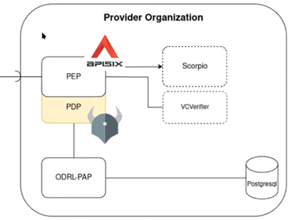
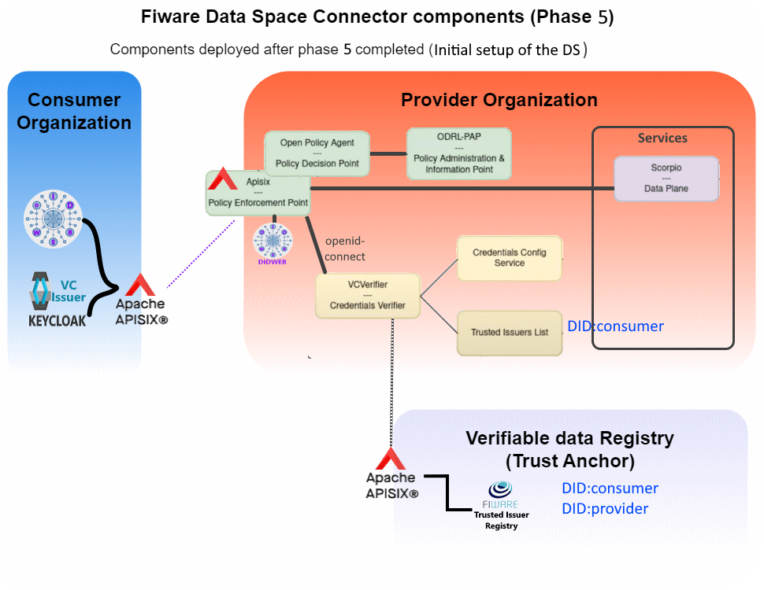

# Final setup of the DS
- [Final setup of the DS](#final-setup-of-the-ds)
  - [Step 5.1-Registration of the Consumer into the data space](#step-51-registration-of-the-consumer-into-the-data-space)
  - [Step 6.2-Registation of the Service into the provider Credential Config Service](#step-62-registation-of-the-service-into-the-provider-credential-config-service)
  - [Step 5.3-Addition of the service route to the Apisix with VC Authentication](#step-53-addition-of-the-service-route-to-the-apisix-with-vc-authentication)
    - [Retrieval of an Access Token from the VCVerifier](#retrieval-of-an-access-token-from-the-vcverifier)
    - [Access the service with the VCVerifier Access Token](#access-the-service-with-the-vcverifier-access-token)
  - [Step 5.4-Addition of the authorization checking to the service route](#step-54-addition-of-the-authorization-checking-to-the-service-route)
    - [Writing ODRL policies](#writing-odrl-policies)
    - [Access the service with the authentication and authorization plugins enabled with the VCVerifier Access Token](#access-the-service-with-the-authentication-and-authorization-plugins-enabled-with-the-vcverifier-access-token)
  - [Bottom line](#bottom-line)

    
The objective of this phase is to explain the actions to register the participant organizations in the dataspace. The provider connection was not fully setup in the previous phase ([deployment of the Provider's infrastructure](README-provider.md)) so this phase will complete it by enabling authentication and authorization mechanisms to the provider.  
This phase is tailored for this walkthrough scenario and hence, some of the interactions to fully comply with the [DSBA Technical Convergence recommendations](https://data-spaces-business-alliance.eu/wp-content/uploads/dlm_uploads/Data-Spaces-Business-Alliance-Technical-Convergence-V2.pdf) are mocked and by now, they are out of the scope of this guideline (by now the latest version is from _250114_) because the interactions with the [GaiaX Clearing Houses (GXDCH)](https://gaia-x.eu/gxdch/) have to be yet fully polished.  

As it has been mentioned, the last step of the [deployment of a provider phase](README-provider.md#step-45-addition-of-the-service-route-to-the-apisix-without-security) left a service accessible, but without any authentication nor authorization implemented, so this phase will solve that scenario.

## Step 5.1-Registration of the Consumer into the data space
Any participant in a data space must be part of it and so, it must be registered at the Trust Anchor and at the providers' Trust Issuer List to be able to access its services.
This registration is made at the [consumer registration section at its helm's value file](../../Helms/consumer/values-did.key.yaml).
```yaml
registration:
  # Used to register the DID to the different TrustedIssuers 
  enabled: true
  job:
    hookDeletePolicy: before-hook-creation
    hook: post-install,post-upgrade
    backoffLimit: 10
  trustedIssuersLists:
    # Registers the connector DID:key in the Trusted Issuer Registry of the DS
    # stating that this DID can participate in the DS
    - name: tir
      tiURL: http://tir.trust-anchor.svc.cluster.local:8080
      issuerDetails: 
        did: $DID      
        credentials: []
    # Registers the connector DID:key in the Trusted Issuer List of the provider stating that this DID can access the Provider DSConnector with a VC of type OperatorCredential with one of the roles: ORDER_PRODUCER or ORDER_CONSUMER
    - name: til
      tiURL: http://til.provider.svc.cluster.local:8080
      issuerDetails: 
        did: $DID 
        credentials: 
          # validFor:
          #   from: "2024-11-26T08:45:00Z"
          #   to: "2034-11-26T08:45:00Z"
          credentialsType: OperatorCredential
          claims:
            # - name: firstName
            #   allowedValues: [ OrderConsumer, OrderProducer ]
            - name: roles.names
              allowedValues:
                - ORDER_CONSUMER
                - ORDER_PROVIDER
            # - name: roles.target
            #   allowedValues:
            #     - $DID
```

To apply it, simply enable the registration section and upgrade the consumer helm chart. This will launch a k8s job to perform the action that will be destroyed around 30 seconds after its finalization:
```shell
hFileCommand consumer u
# Running CMD=[helm -n consumer upgrade -f "./Helms/consumer/values-did.key.yaml" consumer "./Helms/consumer/"  --create-namespace]
...
kGet -n consumer
    NAME                              READY   STATUS      RESTARTS   AGE
    consumer-keycloak-0               1/1     Running     0          4d8h
    consumer-postgresql-0             1/1     Running     0          4d8h
    did-key-549b4996bf-mq7dv          1/1     Running     0          4d8h
    registration-job-h9x9r            0/1     Completed   0          13s
    utils-nettools-597b8ddbfb-w4td4   1/1     Running     0          4d8h

```

The `registration` yaml describes that the DID of the consumer will be registered at:
- The `Trusted Issuer Registry` of the Data Space (_tir at the trust-anchor namespace_) stating that the given DID belongs to the data space.
- The `Trusted Issuer List` of the Provider (_til at the provider namespace_) stating that the consumer can only present `OperatorCredentials` to access the provider's infrastructure with a role of type ORDER_PRODUCER or ORDER_CONSUMER. This verification is made at the authentication phase of the OIDC protocol and any request from this consumer will be rejected if any other credential is presented.

## Step 6.2-Registation of the Service into the provider Credential Config Service
This setup will specify which Trust Issuer Registries and which Trust Issuer List must be visited by the VCVerifier to authenticate any request made to access the service.  
The Fiware architecture enables several Trusted participants to be used and different ones depending on the service to be accessed.  
At this scenario, only one service (_hackathon-service_), one Trusted Participant list and one Trusted Issuer list is setup.
The Service's value file contains a `dataPlaneRegistration` section describing this registration:

```yaml
dataPlaneRegistration:
  enabled: true
  # -- serviceId of the service to be used
  id: hackathon-service
  # -- endpoint of the CredentialConfigService(ccs) to be registered at
  endpoint: http://cconfig.provider.svc.cluster.local:8080
  defaultOidcScope:
      name: default
      oidcScope:
        type: UserCredential
        trustedParticipantsLists:
          - http://tir.trust-anchor.svc.cluster.local:8080
        trustedIssuersLists:
          - http://til.provider.svc.cluster.local:8080  
  otherOidcScopes:
    operator:
      - type: OperatorCredential
        trustedParticipantsLists:
          - http://tir.trust-anchor.svc.cluster.local:8080
        trustedIssuersLists:
          - http://til.provider.svc.cluster.local:8080
```

To apply it, simply enable the `dataPlaneRegistration` section and upgrade the `Service` helm chart:
```shell
hFileCommand service u
# Running CMD=[helm -n service upgrade -f "./Helms/provider/services(dataplane)/values.yaml" services "./Helms/provider/services(dataplane)/"  --create-namespace]
...
```

## Step 5.3-Addition of the service route to the Apisix with VC Authentication    
```shell
# To show the structure of the github after the completion of this step
git checkout phase05.step03
```

  <p style="text-align:center;font-style:italic;font-size: 75%"><br/>
      Authorization components</p>

  To enable the apisix to play the PEP role, this step is adding a plugin to the NGSI-LD service `fiwaredsc-provider.local/ngsi-ld/` route.  
  The plugin will play the PEP (Policy Enforcment Point) role.  
  The `ROUTE_PROVIDER_SERVICE_fiwaredsc_provider_local_authentication` route contains a new plugin `openid-connect`, an authentication protocol based on the OAuth 2.0 that redirects NGSI-LD requests to the VCVerifier, as it implements the [OIDC4VP](https://openid.net/specs/openid-4-verifiable-presentations-1_0.html#request_scope), it will validate the authenticity of the VC presented. Actually, the VC has to be sent by the client embedded inside a VP ([Verifiable Presentation](https://wiki.iota.org/identity.rs/explanations/verifiable-presentations/)).  

```json
"ROUTE_PROVIDER_SERVICE_fiwaredsc_provider_local_authentication": {
    "uri": "/services/hackathon-service/ngsi-ld/*",
    "name": "SERVICE_fiwaredsc_provider_local",
    "host": "fiwaredsc-provider.local",
    "methods": ["GET", "POST", "PUT", "HEAD", "CONNECT", "OPTIONS", "PATCH", "DELETE"],
    "upstream": {
        "type": "roundrobin",
        "scheme": "http",
        "nodes": {
            "ds-scorpio.service.svc.cluster.local:9090": 1
        }
    },
    "plugins": {
        "proxy-rewrite": {
            "regex_uri": ["^/services/hackathon-service/ngsi-ld/(.*)", "/ngsi-ld/\$1"]
        },
        "openid-connect": {
            "bearer_only": true,
            "use_jwks": true,
            "client_id": "hackathon-service",
            "client_secret": "unused",
            "ssl_verify": false,
            "discovery": "http://verifier.provider.svc.cluster.local:3000/services/hackathon-service/.well-known/openid-configuration"    
        }
    }
},
```    
```shell
# Update the apisix route
. ./scripts/manageAPI6Routes.sh insert -r ROUTE_PROVIDER_SERVICE_fiwaredsc_provider_local_authentication
```
This new route redirects request to the verifier. eg:
```shell
kExec net -n cons -- curl http://verifier.provide
r.svc.cluster.local:3000/services/hackathon-service/.well-known/openid-configuration
{
	"issuer": "https://fiwaredsc-provider.local",
	"authorization_endpoint": "https://fiwaredsc-provider.local",
	"token_endpoint": "https://fiwaredsc-provider.local/services/hackathon-service/token",
	"jwks_uri": "https://fiwaredsc-provider.local/.well-known/jwks",
	"scopes_supported": [
		"default",
		"operator"
	],
	"response_types_supported": [
		"token"
	],
	"grant_types_supported": [
		"authorization_code",
		"vp_token"
	],
  ...
}
```

The well known openid-configuration shows a set of urls to perform some operations or to retrieve some info besides some configuration parameters:  
- The `token_endpoint` url is used to request a new token, it is used at the [Retrieval of an access token step](#retrieval-of-an-access-token-from-the-vcverifier).  
- The `jwks_uri` url is used to decypt the Access Token content provided at the [step to access the service with the VCVerifier access token](#access-the-service-with-the-vcverifier-access-token).   
**What is the JWKS?** The [**JSON Web Key Set (JWKS)**](https://auth0.com/docs/secure/tokens/json-web-tokens/json-web-key-sets) _is a set of keys containing the public keys used to verify any JSON Web Token (JWT) issued by the Authorization Server and signed using the RS256 signing algorithm_.
  ```shell
  curl https://fiwaredsc-provider.local/.well-known/jwks
      {
        "keys": [
          {
            "e": "AQAB",
            "kid": "b4KQUtNJC7JjdPFugEce6C3ZzSgeYjo_Qp3vXTkFK4w",
            "kty": "RSA",
            "n": "2SS3SQDb-lLI...ck-lw"
          }
        ]
      }
  ```
    
### Retrieval of an Access Token from the VCVerifier
Again, the same request previously made to get NGSI-LD data should show now a `401 Authorization Required` error
```shell
  # Test the service
  curl -k https://fiwaredsc-provider.local/services/hackathon-service/ngsi-ld/v1/entities?type=Order
  <html>
      <head><title>401 Authorization Required</title></head>
      <body>
      <center><h1>401 Authorization Required</h1></center>
      <hr><center>openresty</center>
      <p><em>Powered by <a href="https://apisix.apache.org/">APISIX</a>.</em></p></body>
      </html>
```

Requests to access the service will require from now on, the possession of a valid JWT token.
The OIDC4VC conversation will require as a Bearer token the proper VC to grant access to the service, VC that has to be embedded inside a ([Verifiable Presentation](https://wiki.iota.org/identity.rs/explanations/verifiable-presentations/)).  
The OIDC conversation begins at the well known url of the service to be accessed (`https://fiwaredsc-provider.local/services/hackathon-service/.well-known/openid-configuration`). From there, the OIDC-Token endpoint is retrieved (`https://fiwaredsc-provider.local/services/hackathon-service/token`) and the interaction following the steps stablished by the **_grant_type=vp_token_** standard to obtain an access token.

The VC to be used is the one generated previously at the section [Issuance of  VCs through a M2M flow (Using API Rest calls)](./README-consumer.md#issue-vcs-through-a-m2m-flow-using-api-rest-calls)

The script [generateAccessTokenFromVC](../../scripts/generateAccessTokenFromVC.sh) will perform this conversation similar to the one shwon in the following demo:

```shell
# First of all, a VC is issued to the user with ORDERCONSUMER role
VERIFIABLE_CREDENTIAL=$(./scripts/issueVC_operator-credential-orderConsumer.sh -v)

# Now, this VC is used to retrieve the JWT validated to access the service
DATA_SERVICE_ACCESS_TOKEN=$(. scripts/generateAccessTokenFromVC.sh $VERIFIABLE_CREDENTIAL)
INFO: EXECUTING SCRIPT [scripts/generateAccessTokenFromVC.sh]:
VERBOSE=[true]
TEST=[false]
PAUSE=[false]
VERIFIABLE_CREDENTIAL=eyJhbGciOi..jEJUYmh-3A
SERVICE_URL=https://fiwaredsc-provider.local/services/hackathon-service
CERT_FOLDER=./.tmp/VPCerts
PRIVATEKEY_FILE=private-key.pem
PUBLICKEY_FILE=public-key.pem
STOREPASSWORD_LENGTH=128
ACCESSTOKEN_SCOPE=operator
---


OIDC_URL_WELLKNOWN=[https://fiwaredsc-provider.local/services/hackathon-service/.well-known/openid-configuration]
OIDC_ACCESSTOKEN_URL=[https://fiwaredsc-provider.local/services/hackathon-service/token]
---
Generating Certificates to sign the Verifiable Presentation
- Certificates to sign the DID generated at './.tmp/VPCerts' folder.


- DID [did:key:zDnaeSY1zkpZsAWLyEGqQVLGrrzNokBXtkTkh2TGvARdHS7Jh] to sign the Verifiable Presentation generated
---
- Generate a VerifiablePresentation, containing the Verifiable Credential:
        1- Setup the header:
Header: eyJhbGciOiJFUzI1Ni...
        2- Setup the payload:
Payload: eyJpc3MiOiAiZGlkOmtleTp6RG5...
        3- Create the signature:
Signature: MEUCIEVj67mroUbRssanAcO...
        4- Combine them to generate the JWT:
VP_JWT: eyJhbGciOiJFUzI1NiIsICJ0eXAiOiJKV1QiLCAia2lkIjoiZGlkOmtleTp6RG5hZVNZMXprcFpzQVdMeUVHcVFWTEdycnpOb2tCWHRrVGtoMlRHdkFSZEhTN0poIn0.eyJpc3MiOiAiZGlkOmtleTp6RG5hZVNZMXprcFpzQVdMeUVHcVFWTEdycnpOb2tCWHRrVGtoMlRHdkFSZEhTN0poIiwgInN1YiI6ICJkaWQ6a2V5OnpEbmFlU1kxemtwWnNBV0x5RUdxUVZMR3Jyek5va0JYdGtUa2gyVEd2QVJkSFM3SmgiLCAidnAiOiB7CiAgICAiQGNvbnRleHQiOiBbImh0dHBzOi8vd3d3LnczLm9yZy8yMDE4L2NyZWRlbnRpYWxzL3YxIl0sCiAgICAidHlwZSI6IFsiVmVyaWZpYWJsZVByZXNlbnRhdGlvbiJdLAogICAgInZlcmlmaWFibGVDcmVkZW50aWFsIjogWwogICAgICAgICJleUpoYkdjaU9pSkZVekkxTmlJc0luUjVjQ0lnT2lBaVNsZFVJaXdpYTJsa0lpQTZJQ0prYVdRNmEyVjVPbnBFYm1GbGNrdERURzVqYjFoa09WaDJNMDFZYVROYWQyVmtlbkpPVmt0bFdIVlhkbGN4UVVSTFREWjFjbXR5WldraWZRLmV5SnVZbVlpT2pFM016UXhOVGt3T1RRc0ltcDBhU0k2SW5WeWJqcDFkV2xrT21NMU5qYzVZakEwTFdGaE4yTXROR1JtWXkxaE5EQTNMVEpsTVRjd1pqZzVZakUwTVNJc0ltbHpjeUk2SW1ScFpEcHJaWGs2ZWtSdVlXVnlTME5NYm1OdldHUTVXSFl6VFZocE0xcDNaV1I2Y2s1V1MyVllkVmQyVnpGQlJFdE1OblZ5YTNKbGFTSXNJblpqSWpwN0luUjVjR1VpT2xzaVQzQmxjbUYwYjNKRGNtVmtaVzUwYVdGc0lsMHNJbWx6YzNWbGNpSTZJbVJwWkRwclpYazZla1J1WVdWeVMwTk1ibU52V0dRNVdIWXpUVmhwTTFwM1pXUjZjazVXUzJWWWRWZDJWekZCUkV0TU5uVnlhM0psYVNJc0ltbHpjM1ZoYm1ObFJHRjBaU0k2TVRjek5ERTFPVEE1TkM0Mk1qWXdNREF3TURBc0ltTnlaV1JsYm5ScFlXeFRkV0pxWldOMElqcDdJbVpwY25OMFRtRnRaU0k2SWs5eVpHVnlRMjl1YzNWdFpYSWlMQ0pzWVhOMFRtRnRaU0k2SWxWelpYSWlMQ0p5YjJ4bGN5STZXM3NpYm1GdFpYTWlPbHNpVDFKRVJWSmZRMDlPVTFWTlJWSWlYU3dpZEdGeVoyVjBJam9pWkdsa09tdGxlVHA2Ukc1aFpYSkxRMHh1WTI5WVpEbFlkak5OV0drelduZGxaSHB5VGxaTFpWaDFWM1pYTVVGRVMwdzJkWEpyY21WcEluMWRMQ0psYldGcGJDSTZJbTl5WkdWeVkyOXVjM1Z0WlhKMWMyVnlRR052Ym5OMWJXVnlMbTl5WnlKOUxDSkFZMjl1ZEdWNGRDSTZXeUpvZEhSd2N6b3ZMM2QzZHk1M015NXZjbWN2TWpBeE9DOWpjbVZrWlc1MGFXRnNjeTkyTVNJc0ltaDBkSEJ6T2k4dmQzZDNMbmN6TG05eVp5OXVjeTlqY21Wa1pXNTBhV0ZzY3k5Mk1TSmRmWDAuRzllYjFuend6WEpvdlNEck9lREkwU1ZzMmxDajRna0JTR0ZXMkVLQlVod1VDLVNoTGtKLXdrMmJLUEdyeGpaRVg4dTczaFRQQkluYmpFSlVZbWgtM0EiCiAgICBdLAogICAgImhvbGRlciI6ICJkaWQ6a2V5OnpEbmFlU1kxemtwWnNBV0x5RUdxUVZMR3Jyek5va0JYdGtUa2gyVEd2QVJkSFM3SmgiCiAgfX0.MEUCIEVj67mroUbRssanAcOD3R_jAGb4B0gpiFbnQI5jdwwQAiEAiZXxMb_o0nzCGFn-OXNgY4JUljvbJBXqtnKmaaV7OKE
        5- The VP_JWT representation of the VP_JWT has to be Base64-encoded(no padding!) (This is not a JWT):
VP_TOKEN=ZXlKaGJHY2lPaUpGVXp...
---
Next step asks for an access token to be used to request the service (This is a JWT)
DATA_SERVICE_ACCESS_TOKEN=eyJhbGciOiJSUzI1NiIsImtpZCI6ImI0S1FVdE5KQzdKamRQRnVnRWNlNkMzWnpTZ2VZam9fUXAzdlhUa0ZLNHciLCJ0eXAiOiJKV1QifQ.eyJhdWQiOlsiaGFja2F0aG9uLXNlcnZpY2UiXSwiY2xpZW50X2lkIjoiZGlkOmtleTp6RG5hZWpSQW5lODJ1TlZqcGZBSlNjdUVOaTJGNjJvOUg1QktUNXlKWGIzemNkckZqIiwiZXhwIjoxNzM0MzMzNDc0LCJpc3MiOiJkaWQ6a2V5OnpEbmFlalJBbmU4MnVOVmpwZkFKU2N1RU5pMkY2Mm85SDVCS1Q1eUpYYjN6Y2RyRmoiLCJraWQiOiJiNEtRVXROSkM3SmpkUEZ1Z0VjZTZDM1p6U2dlWWpvX1FwM3ZYVGtGSzR3Iiwic3ViIjoiIiwidmVyaWZpYWJsZUNyZWRlbnRpYWwiOnsiQGNvbnRleHQiOlsiaHR0cHM6Ly93d3cudzMub3JnLzIwMTgvY3JlZGVudGlhbHMvdjEiLCJodHRwczovL3d3dy53My5vcmcvbnMvY3JlZGVudGlhbHMvdjEiXSwiY3JlZGVudGlhbFN1YmplY3QiOnsiZW1haWwiOiJvcmRlcmNvbnN1bWVydXNlckBjb25zdW1lci5vcmciLCJmaXJzdE5hbWUiOiJPcmRlckNvbnN1bWVyIiwibGFzdE5hbWUiOiJVc2VyIiwicm9sZXMiOlt7Im5hbWVzIjpbIk9SREVSX0NPTlNVTUVSIl0sInRhcmdldCI6ImRpZDprZXk6ekRuYWVyS0NMbmNvWGQ5WHYzTVhpM1p3ZWR6ck5WS2VYdVd2VzFBREtMNnVya3JlaSJ9XX0sImlkIjoidXJuOnV1aWQ6YzU2NzliMDQtYWE3Yy00ZGZjLWE0MDctMmUxNzBmODliMTQxIiwiaXNzdWFuY2VEYXRlIjoiMjAyNC0xMi0xNFQwNjo1MTozNFoiLCJpc3N1ZXIiOiJkaWQ6a2V5OnpEbmFlcktDTG5jb1hkOVh2M01YaTNad2VkenJOVktlWHVXdlcxQURLTDZ1cmtyZWkiLCJ0eXBlIjpbIk9wZXJhdG9yQ3JlZGVudGlhbCJdfX0.bnN3Giq0fMTb29zrvw38MAMUm53WSt-bKHKkCkOSx3zZBw5Yd3a3iwBfQ3G05T6qKaeADOCdPvw19FwPF6iJq1TXLPIIvIGexmkDzH4vMudu1CJo1vEKK0Rj6uMkqaw4zpzInRn82a7GgckOjqHL8CdyBqWi7yYqoLkbmqqdck80_DiLdAmYUGgRBLvCDNbFkNLDYngkfX3fqwQKuJX32h0C1YQuhbfsy-CjW_Vvzs58gA0vfYnM8CNwHQLd4ZaVIWB-rTpnAyO5Wgs_sWEFhECsW5MO5a-fHqiUCEOQT5oX3f9Y2Rx0erwZL3zhzxqCG_ZmOTy-Qgr0P13DHJYCXg
```

**NOTE**: To avoid regenerating the VC and the DATA_SERVICE_ACCESS_TOKEN, bear in mind that the VC does not have an expiration date, but the DATA_SERVICE_ACCESS_TOKEN has a lifespan of 30 mins.

### Access the service with the VCVerifier Access Token
At this stage the previous request attaching the Bearer _DATA_SERVICE_ACCESS_TOKEN_ token should be authenticated, but...

```shell
# First of all, a VC is issued to the user with ORDERCONSUMER role
VERIFIABLE_CREDENTIAL=$(./scripts/issueVC_operator-credential-orderConsumer.sh -v)

# Now, this VC is used to retrieve the JWT validated to access the service
DATA_SERVICE_ACCESS_TOKEN=$(. scripts/generateAccessTokenFromVC.sh $VERIFIABLE_CREDENTIAL)

curl -k https://fiwaredsc-provider.local/services/hackathon-service/ngsi-ld/v1/entities?type=Order \
    --header "Accept: application/json" \
    --header "Authorization: Bearer ${DATA_SERVICE_ACCESS_TOKEN}"
        <html>
              <head><title>401 Authorization Required</title></head>
              ...
```

The request is still failing. An analysis of the apisix logs shows the reason:
```shell
kLogs -n apisix --since 1s data-plane -y
    # Running command [kubectl logs -n apisix --since 1s -f pod/apisix-data-plane-6d5f868b54-dqknb -c wait-for-control-plane]
    ...
    openidc.lua:740: openidc_jwks(): accessing jwks url (https://fiwaredsc-provider.local/.well-known/jwks) failed: failed to parse domain
    ...
```

**NOTE**: Among multiple messages, one of the interesting ones points to the fact that a local DNS is used (`fiwaredsc-provider.local`), local DNS which is unknown to the apisix-data plane. The best solution would be to use a global DNS (eg. `yourorganization.com`), but for shake of simplicity, a solution would be to add the used local DNSs (`fiwaredsc-provider.local`) to the apisix-data-plane:/etc/hosts file. The [apisix values file](../../Helms/apisix/values.yaml) has been modified to include such trick although is not recomended for production environments. 

```shell
# Redeployment of the apisix-data-plane with the local DNSs injected into the /etc/hosts file
# 1- Removes the data-plane deployment
kRemoveRestart -n api data-plane  deploy -y
  # Running command [kubectl delete -n apisix deploy apisix-data-plane]

# 2- Upgrades the apisix helm chart
hFileCommand apisix upgrade
  # Running CMD=[helm -n apisix upgrade -f "./Helms/apisix/values.yaml" apisix "./Helms/apisix/"  --create-namespace]

# 3- Wait till the pod apisix-data-plane has been fully deployed
  kGet -n apisix -w
  # Running CMD=[kubectl get pod -n apisix]
```

A new try to access the service does success using local DNSs:
```shell
echo "# First of all, a VC is issued to the user with ORDERCONSUMER role"
VERIFIABLE_CREDENTIAL=$(./scripts/issueVC_operator-credential-orderConsumer.sh -v)

echo "# Now, this VC is used to retrieve the JWT validated to access the service"
DATA_SERVICE_ACCESS_TOKEN=$(. scripts/generateAccessTokenFromVC.sh $VERIFIABLE_CREDENTIAL -v)

echo "# Access to the service:"
curl -k https://fiwaredsc-provider.local/services/hackathon-service/ngsi-ld/v1/entities?type=Order \
    --header "Accept: application/json" \
    --header "Authorization: Bearer ${DATA_SERVICE_ACCESS_TOKEN}"
[ {
  "id" : "urn:ngsi-ld:Order:SDBrokerId-Spain.2411331.000003",
  "type" : "Order",
  "dateCreated" : {
    "type" : "Property",
    "value" : {
      "type" : "DateTime",
      "@value" : "2022-03-31T13:20:00Z"
    }
...
```

```shell
# To show the structure of the github after the completion of the next step
git checkout phase05.step04
```

## Step 5.4-Addition of the authorization checking to the service route
```shell
# To show the structure of the github after the completion of this step
git checkout phase05.step04
```

<p style="text-align:center;font-style:italic;font-size: 75%"><br/>
      Authorization components</p>

At this step, new plugin (`opa`) will be added to the service route to perform authorization tasks. The plugin will forward any request already authenticated to the `Open Policy Agent (OPA)` to verify that it complies with the ODRL policies defined.  
Again, a new apisix route (`ROUTE_PROVIDER_SERVICE_fiwaredsc_provider_local_2auth`) will be deployed enabling both authentication and authorization for the `https://fiwaredsc-provider.local/services/hackathon-service/ngsi-ld/*` endpoints. 

```json
ROUTE_PROVIDER_SERVICE_fiwaredsc_provider_local_2auth='{
  "uri": "/services/hackathon-service/ngsi-ld/*",
  "name": "SERVICE_fiwaredsc_provider_local",
  "host": "fiwaredsc-provider.local",
  "methods": ["GET", "POST", "PUT", "HEAD", "CONNECT", "OPTIONS", "PATCH", "DELETE"],
  "upstream": {
      "type": "roundrobin",
      "scheme": "http",
      "nodes": {
          "ds-scorpio.service.svc.cluster.local:9090": 1
      }
  },
  "plugins": {
      "proxy-rewrite": {
          "regex_uri": ["^/services/hackathon-service/ngsi-ld/(.*)", "/ngsi-ld/\$1"]
      },
      "openid-connect": {
          "bearer_only": true,
          "use_jwks": true,
          "client_id": "hackathon-service",
          "client_secret": "unused",
          "ssl_verify": false,
          "discovery": "http://verifier.provider.svc.cluster.local:3000/services/hackathon-service/.well-known/openid-configuration"    
      },
      "opa": {
          "host": "http://opa.provider.svc.cluster.local:8181",
          "policy": "policy/main",
          "with_route": true,
          "with_service": true,
          "with_consumer": true,
          "with_body": true
      }
  }
}'
```

```shell
# Update the apisix route
. ./scripts/manageAPI6Routes.sh insert -r ROUTE_PROVIDER_SERVICE_fiwaredsc_provider_local_2auth
```

The plugin redirects requests made to the ´/services/hackathon-service/ngsi-ld/*´ endpoint to the `OPA` service to verify its credentials.

At this stage, a request to the service will fail again but with a 403 Forbidden error:
```shell
export VERIFIABLE_CREDENTIAL=$(. scripts/issueVC_operator-credential-orderConsumer.sh -v)
export DATA_SERVICE_ACCESS_TOKEN=$(scripts/generateAccessTokenFromVC.sh $VERIFIABLE_CREDENTIAL -v)
curl -k https://fiwaredsc-provider.local/services/hackathon-service/ngsi-ld/v1/entities?type=Order \
  --header "Accept: application/json" \
  --header "Authorization: Bearer ${DATA_SERVICE_ACCESS_TOKEN}"
      <html>
        <head><title>403 Forbidden</title></head>
      ...
```

To gain access to the resource, a set of ODRL policies have to be addedd.

### Writing ODRL policies
This setup will deploy policies to authorize access to the service depending on the provided credential.

The [authorization helm's values file](../../Helms/provider/authorization(odrlpap+opa)/values.yaml) contains a `odrlPolicyRegistration` section with the policies to be deployed for this use case:

```yaml
odrlPolicyRegistration:
  enabled: true
  job:
    hookDeletePolicy: before-hook-creation
    hook: post-install,post-upgrade
    backoffLimit: 1
  # -- service id of the hackathon-service to be used
  id: hackathon-service
  # -- endpoint of the ccs to regsiter at
  odrlPAPEndpoint: http://odrl-pap.provider.svc.cluster.local:8080/policy
  odrlPolicies:
    ODRL_ORDER_READER:
      "@context":
        dc: http://purl.org/dc/elements/1.1/
        dct: http://purl.org/dc/terms/
        owl: http://www.w3.org/2002/07/owl#
        odrl: http://www.w3.org/ns/odrl/2/
        rdfs: http://www.w3.org/2000/01/rdf-schema#
        skos: http://www.w3.org/2004/02/skos/core#
      "@id": https://fiwaredsc-provider.local/policy/common/type-order-reader
      "@type": odrl:Policy
      odrl:permission:
        odrl:action:
          "@id": odrl:read
        odrl:target:
          "@type": odrl:AssetCollection
          odrl:source: urn:asset
          odrl:refinement:
          - "@type": odrl:Constraint
            odrl:leftOperand: ngsi-ld:entityType
            odrl:operator:
              "@id": odrl:eq
            odrl:rightOperand: Order
              # 
        odrl:assignee:
          "@type": odrl:PartyCollection
          odrl:source: urn:user
          odrl:refinement:
            "@type": odrl:LogicalConstraint
            odrl:and:
        # # Policy 1: Any can access
        # # odrl:assignee:
        # #   "@id": vc:any

        # # Policy2: "@id": vc:currentParty -> current_party(credential) := credential.issuer
                - "@type": odrl:Constraint
                  odrl:leftOperand:
                    "@id": vc:currentParty
                  odrl:operator:
                    "@id": odrl:eq
                  odrl:rightOperand:
                    "@value": did:key:zDnaewJ2tgBDT1ah7U8XqFavKtDPgDxqvJLLBMFMyAVQQy2Bn
                    "@type": xsd:string

        # Policy3: "@id": vc:type -> types(verifiable_credential) := verifiable_credential.type
                - "@type": odrl:Constraint
                  odrl:leftOperand:
                    "@id": vc:type
                  odrl:operator:
                    "@id": odrl:hasPart
                  odrl:rightOperand:
                    "@value": OperatorCredential
                    "@type": xsd:string
```
To apply the policies, simply enable the `odrlPolicyRegistration` section and upgrade the authorization helm chart:
```shell
hFileCommand authorization upgrade
    # Running CMD=[helm -n provider upgrade -f "./Helms/provider/authorization(odrlpap+opa)/./values.yaml" provider-authorization "./Helms/provider/authorization(odrlpap+opa)/./"  --create-namespace]
    ...
kGet -n provider
    ...
```

### Access the service with the authentication and authorization plugins enabled with the VCVerifier Access Token
With the retrieved access token, the previous request could be launched again with success.  


```shell
export VERIFIABLE_CREDENTIAL_OCONSUMER=$(. scripts/issueVC_operator-credential-orderConsumer.sh -v)
export DATA_SERVICE_ACCESS_TOKEN_OCONSUMER=$(scripts/generateAccessTokenFromVC.sh $VERIFIABLE_CREDENTIAL_OCONSUMER -v)
curl -k https://fiwaredsc-provider.local/services/hackathon-service/ngsi-ld/v1/entities?type=Order \
    --header "Accept: application/json" \
    --header "Authorization: Bearer ${DATA_SERVICE_ACCESS_TOKEN_OCONSUMER}"
export VERIFIABLE_CREDENTIAL_OPRODUCER=$(. scripts/issueVC_operator-credential-orderProducer.sh -v)
export DATA_SERVICE_ACCESS_TOKEN_OPRODUCER=$(scripts/generateAccessTokenFromVC.sh $VERIFIABLE_CREDENTIAL_OPRODUCER -v)
curl -k https://fiwaredsc-provider.local/services/hackathon-service/ngsi-ld/v1/entities?type=Order \
  --header "Accept: application/json" \
  --header "Authorization: Bearer ${DATA_SERVICE_ACCESS_TOKEN_OPRODUCER}"
        [ {
          "id" : "urn:ngsi-ld:Order:SDBrokerId-Spain.2411331.000003",
          "type" : "Order",
          "dateCreated" : {
            "type" : "Property",
            "value" : {
              "type" : "DateTime",
        ...
```

## Bottom line
The setup of the data space leaves a complete scenario enabling the customization defining _business, operational and organizational agreements among participants_ via the policy definitions. Each participant has control over their data and services _stablishing the conditions of their access while facilitating data sharing agreements_

<p style="text-align:center;font-style:italic;font-size: 75%"><br/>
Architecture after the provider components deployment is completed</p>

From now on, the provider can replace the HOL service by its own one/ones and define its own ODRL policies to tailor access to these services.