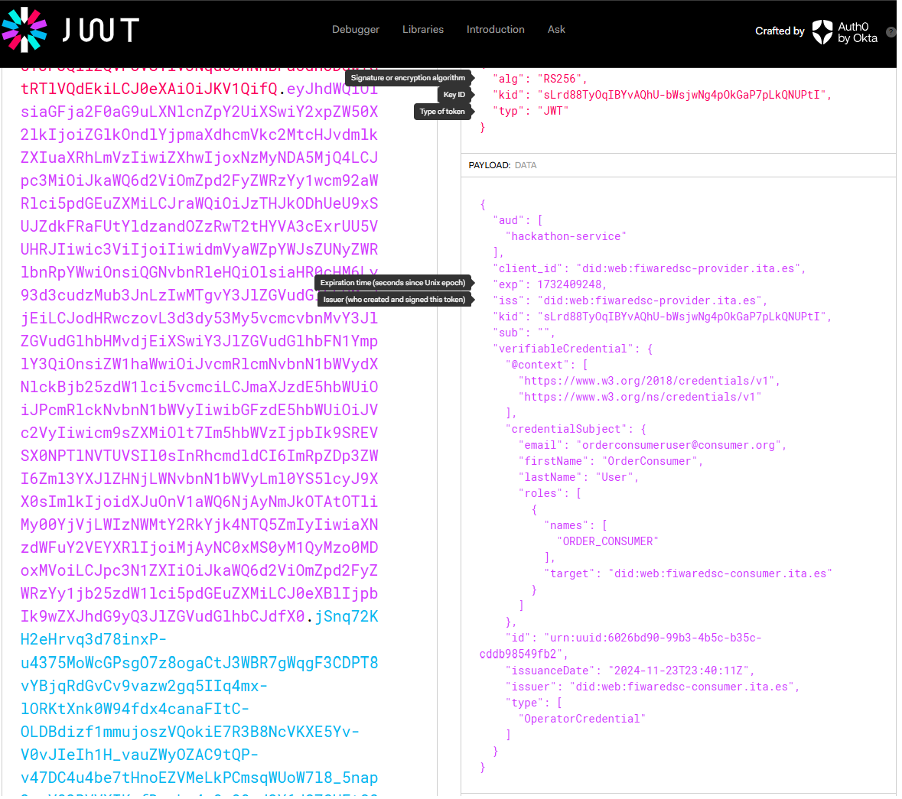

# Initial setup of the DS
- [Initial setup of the DS](#initial-setup-of-the-ds)
  - [Step 6.1-Registering the consumer into the data space](#step-61-registering-the-consumer-into-the-data-space)
  - [Step 6.2-Registering the Service into the provider Credential Config Service](#step-62-registering-the-service-into-the-provider-credential-config-service)
  - [Step 6.3-Addition of the service route to the Apisix with VC Authentication](#step-63-addition-of-the-service-route-to-the-apisix-with-vc-authentication)
    - [Apisix routes](#apisix-routes)
    - [Retrieval of an Access Token from the VCVerifier](#retrieval-of-an-access-token-from-the-vcverifier)
    - [Access the service with the VCVerifier Access Token](#access-the-service-with-the-vcverifier-access-token)
  - [Bottom line](#bottom-line)

    
The objective of this phase is to explain the actions to register the participants in the dataspace and will continue the configuration to provide authentication and authorization mechanisms to the provider data space Connector infrastructure.  
This phase is tailored for this walkthrough scenario. Interactions to fully comply with the [DSBA Technical Convergence recommendations](https://data-spaces-business-alliance.eu/wp-content/uploads/dlm_uploads/Data-Spaces-Business-Alliance-Technical-Convergence-V2.pdf) are out of the scope of this guideline (by now _241105_) and some use cases, for example the LEAR registration of a organization using a [GaiaX Clearing Houses (GXDCH)](https://gaia-x.eu/gxdch/) because such interactions are yet to be polished.  

The last step of the [deployment of a provider](README-provider.md#step-45-addition-of-the-service-route-to-the-apisix-without-security) left a [service accessible](https://fiwaredsc-provider.ita.es/ngsi-ld/v1/entities?type=Order) but without any authentication nor authorization implemented.

## Step 6.1-Registering the consumer into the data space
Any participant in a data space must be registered at the Trust Anchor alongside the providers' Trust Issuer List which services the participant will access.
This registration is made at the [consumer helm chart registration section](../../Helms/consumer/values-did.web.yaml).
```yaml
registration:
  # Used to register the DID to the different TrustedIssuers 
  enabled: true
  name: registration-job
  job:
    hookDeletePolicy: before-hook-creation
    hook: post-install,post-upgrade
    backoffLimit: 10
  trustedIssuersLists:
    # Registers the connector DID:web in the Trusted Issuer Registry of the DS
    # stating that this DID can participate in the DS
    - name: tir
      tiURL: http://tir.trust-anchor.svc.cluster.local:8080
      issuerDetails: 
        did: $DID      
        credentials: []
    # Registers the connector DID:web in the Trusted Issuer List of the provider 
    # stating that this DID can access the Provider DSConnector with VC of type OperatorCredential
    - name: til
      tiURL: http://til.provider.svc.cluster.local:8080
      issuerDetails: 
        did: $DID 
        credentials: 
          - credentialsType: OperatorCredential
```
The yaml describes that the DID of the consumer will be registered at:
- The Trusted Issuer Registry of the Data Space (_tir at the trust-anchor namespace_) stating only that the given DID belongs to the data space.
- The Trusted Issuer List of the Provider (_til at the provider namespace_) stating that the consumer can present OperatorCredentials to access the provider's infrastructure. This verification is made at the authentication phase of the OIDC protocol and any request from this consumer will be rejected if any other credential is presented.
## Step 6.2-Registering the Service into the provider Credential Config Service
This setup will specify which Trust Issuer Registries and which Trust Issuer List must be visited by the VCVerifier to authenticate any request.  
The Fiware architecture enables several Trusted participants to be used and different ones depending on the service to be accessed.  
At this scenario, only one service (_hackathon-service_), one Trusted Participant list and one Trusted Issuer list is setup.

```yaml
dataPlaneRegistration:
  enabled: true
  configMapName: data-plane-registration
  # -- service id of the hackathon-service to be used
  id: hackathon-service
  # -- endpoint of the ccs to regsiter at
  endpoint: http://cconfig.provider.svc.cluster.local:8080
  defaultOidcScope:
      name: default
      oidcScope:
        type: UserCredential
        trustedParticipantsLists:
          - http://tir.trust-anchor.svc.cluster.local:8080
        trustedIssuersLists:
          - http://til.provider.svc.cluster.local:8080  
  otherOidcScopes:
    operator:
      - type: OperatorCredential
        trustedParticipantsLists:
          - http://tir.trust-anchor.svc.cluster.local:8080
        trustedIssuersLists:
          - http://til.provider.svc.cluster.local:8080
```


## Step 6.3-Addition of the service route to the Apisix with VC Authentication    
### Apisix routes
This step is adding a bundle of new routes to the apisix to enable the routes to the service.
1. As the `/services/hackathon-service/ngsi-ld` route already exists, it can be deleted using the [apisix dashboard page](https://fiwaredsc-api6dashboard.local/routes/list?page=1&pageSize=50) and redeployed using the ENV VAR `ROUTE_fiwaredsc_provider_hackathon_service` defined at the [managementAPI6Routes script file](../../scripts/manageAPI6Routes.sh):
This new route, contains a new Apisix plugin `openid-connect`, an authentication protocol based on the OAuth 2.0 that redirects NGSI-LD requests to the VCVerifier. 
    ```json
    ROUTE_fiwaredsc_provider_hackathon_service='{
      "uri": "/services/hackathon-service/ngsi-ld/*",
      ...
      "plugins": {
        "proxy-rewrite": {
            "regex_uri": ["^/ngsi-ld/(.*)", "/ngsi-ld/$1"]
        },
        "openid-connect": {
          "bearer_only": true
          "use_jwks": true
          "client_id": "hackathon-service"
          "client_secret": "unused"
          "ssl_verify": "false"
          "discovery": "http://verifier.provider.svc.cluster.local:3000/services/hackathon-service/.well-known/openid-configuration"    
        }
      }
    }'
    ```
    As you can see, the plugin redirects requests made to the ´/services/hackathon-service/ngsi-ld/*´ endpoint to the ´VCVerifier´ to authenticate it.  

2. As the service implements the OIDC protocol, its well known endpoint has also to be  available. Deploy the ENV VAR `ROUTE_fiwaredsc_provider_hackathon_service_OIDC`:  

    ```json
    ROUTE_fiwaredsc_provider_hackathon_service_OIDC='{
      "uri": "/services/hackathon-service/*",
      "name": "Hackathon_service",
      "host": "fiwaredsc-provider.ita.es",
      "methods": ["GET"],
      "upstream": {
        "type": "roundrobin",
        "nodes": {
          "verifier.provider.svc.cluster.local:3000": 1
        }
      },
      "plugins": {
          "proxy-rewrite": {
              "regex_uri": ["^/services/hackathon-service/(.*)", "/services/hackathon-service/$1"]
          }
      }
    }'
    ```
    This new route redirects request to the verifier. eg:
    ```shell
    curl https://fiwaredsc-provider.ita.es/services/hackathon-service/.well-known/openid-configuration
        {
          "issuer": "https://fiwaredsc-provider.ita.es",
          "authorization_endpoint": "https://fiwaredsc-provider.ita.es",
          "token_endpoint": "https://fiwaredsc-provider.ita.es/services/hackathon-service/token",
          "jwks_uri": "https://fiwaredsc-provider.ita.es/.well-known/jwks",
          "scopes_supported": [
            "operator",
            "default"
          ],
          ...
        }
    ```
  3. The well known openid-configuration shows a set of urls to perform some operations or to retrieve some info besides some configuration parameters:
      - The `token_endpoint` url used to request for a new token, used at the [Retrieval of an access token step](#retrieval-of-an-access-token-from-the-vcverifier).  
      `https://fiwaredsc-provider.ita.es/services/hackathon-service/token`: URL already served by the `ROUTE_fiwaredsc_provider_hackathon_service_OIDC` route.
      - The `jwks_uri` url used to decypt the Access Token content provided at the [step to access the service with the VCVerifier access token](#access-the-service-with-the-vcverifier-access-token).  
      `https://fiwaredsc-provider.ita.es/.well-known/jwks`: This route is not served by the Apisix, so a new route has to be added. Use the `ROUTE_fiwaredsc_provider_wellKnownJWKS`  
      **What is the JWKS?** The [**JSON Web Key Set (JWKS)**](https://auth0.com/docs/secure/tokens/json-web-tokens/json-web-key-sets) _is a set of keys containing the public keys used to verify any JSON Web Token (JWT) issued by the Authorization Server and signed using the RS256 signing algorithm_.
        ```shell
        curl https://fiwaredsc-provider.ita.es/.well-known/jwks
            {
              "keys": [
                {
                  "e": "AQAB",
                  "kid": "sLrd88T...NUPtI",
                  "kty": "RSA",
                  "n": "_EiBivJbXzAx...Ui9kVUw"
                }
              ]
            }
        ```
    
### Retrieval of an Access Token from the VCVerifier
  Before the retrieval begins, let's try the same request made to get NGSI-LD data to see that with the new route plugin (`openid-connect`), an erro `401 Authorization Required` is returned.
  ```shell
    # Test the service
    curl https://fiwaredsc-provider.ita.es/services/hackathon-service/ngsi-ld/v1/entities?type=Order
        <html>
        <head><title>401 Aufthorization Required</title></head>
        <body>
        <center><h1>401 Authorization Required</h1></center>
        <hr><center>openresty</center>
        <p><em>Powered by <a href="https://apisix.apache.org/">APISIX</a>.</em></p></body>
        </html>
  ```

  Requests to access the service will require from now on the possession of a valid JWT token provided by the Verifier, but it will require in the context of the OIDC conversation, a proper VC to provide this JWT Access Token.  
  The VC that has to be embedded inside a ([Verifiable Presentation](https://wiki.iota.org/identity.rs/explanations/verifiable-presentations/)) as part of the protocol specification.  
  
  The process begins perusing at the well known OIDC endpoint of the service to be accessed (`https://fiwaredsc-provider.ita.es/services/hackathon-service/.well-known/openid-configuration`). From there, the OIDC Token URL endpoint is retrieved (`https://fiwaredsc-provider.ita.es/services/hackathon-service/token`) and then, the OIDC conversation begins following the rules set by the **_grant_type=vp_token_** to obtain an access token.
  
  The VC to be used is the one generated previously at the section [Issuance of  VCs through a M2M flow (Using API Rest calls)](README-consumer.md#issue-vcs-through-a-m2m-flow-using-api-rest-calls)

  The script [generateAccessTokenFromVC](../../scripts/generateVPToken.sh) will perform this conversation as the conversation shown at the following demo (_the different tokens have been truncated to avoid an endless and boring script_):

  ```shell
  export VERIFIABLE_CREDENTIAL=$(. scripts/issueVC_operator-credential-orderConsumer.sh -v)
  scripts/generateAccessTokenFromVC.sh $VERIFIABLE_CREDENTIAL 
      INFO: EXECUTING SCRIPT [scripts/generateAccessTokenFromVC.sh]:
      VERBOSE=[true]
      TEST=[false]
      PAUSE=[false]
      VERIFIABLE_CREDENTIAL=eyJhbGciOi..WU8xuBWLXA
      OIDC_URL=https://fiwaredsc-provider.ita.es
      CERT_FOLDER=./.tmp/VPCerts
      PRIVATEKEY_FILE=private-key.pem
      PUBLICKEY_FILE=public-key.pem
      STOREPASSWORD_LENGTH=128
      ACCESSTOKEN_SCOPE=operator
      ---
      Generating Certificates to sign the Verifiable Presentation
      - Certificates to sign the DID generated at './.tmp/VPCerts' folder.
      - DID [did:key:zDnaeSz6xXkTik1dZ2Cw92UjGtMAc84knWJK4ioj1J9u8h5Uq] to sign the Verifiable Presentation generated
      ---
      - Generate a VerifiablePresentation, containing the Verifiable Credential:
              1- Setup the header:
      Header: eyJhb...
      ---
              2- Setup the payload:
      Payload: eyJpc3MiOiAiZGlk...
              3- Create the signature:
      Signature: MEUCIBdt...
              4- Combine them to generate the JWT:
      VP_JWT: eyJhbGciOiJFUz...
              5- The VP_JWT representation of the VP_JWT has to be Base64-encoded(no padding!) (This is not a JWT):
      VP_TOKEN=ZXlKaGJHY2lPaUpG...5hffIpsqqYAB8
      ---
      - Finally An access token is returned to be used to request the service (This is a JWT)
      export ACCESS_TOKEN=eyJhbGciOiJS...rc-L-_w
  ```
The following image shows the info contained by the JWT ACCESS_TOKEN
<p style="text-align:center;font-style:italic;font-size: 75%"><br/>
    Analysis of the VCVerifier Access Token</p>

### Access the service with the VCVerifier Access Token
With the retrieved access token, the previous request could be launched again (_the -v parameter launches the scripts in a !verbose mode, so only the final value is returned_):
```shell
  export VERIFIABLE_CREDENTIAL=$(. scripts/issueVC_operator-credential-orderConsumer.sh -v)
  export ACCESS_TOKEN=$(scripts/generateAccessTokenFromVC.sh $VERIFIABLE_CREDENTIAL -v)
  curl https://fiwaredsc-provider.ita.es/services/hackathon-service/ngsi-ld/v1/entities?type=Order \
    --header "Accept: application/json" \
    --header "Authorization: Bearer ${ACCESS_TOKEN}"
        [ {
          "id" : "urn:ngsi-ld:Order:SDBrokerId-Spain.2411331.000003",
          "type" : "Order",
          "dateCreated" : {
            "type" : "Property",
            "value" : {
              "type" : "DateTime",
        ...
```


## Bottom line
The setup of the data space leaves a complete scenario enabling the customization defining _business, operational and organizational agreements among participants_ via the policy definitions.
Each participant has control over their data and services _stablishing the conditions of their access while facilitating data sharing agreements_