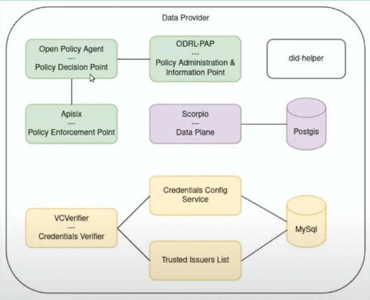
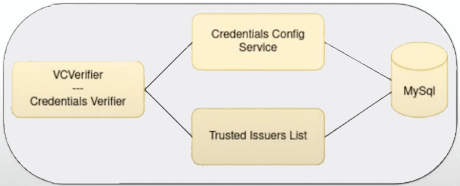

# Provider's infrastructure
- [Provider's infrastructure](#providers-infrastructure)
  - [step04.1- _Deployment of the common components_](#step041--deployment-of-the-common-components)
  - [step04.2- _Deployment of the authentication components_](#step042--deployment-of-the-authentication-components)
    - [Verification of the deployment so far](#verification-of-the-deployment-so-far)

    
The objective of this phase is to deploy the following infrastructure.
<p style="text-align:center;font-style:italic;font-size: 75%"><br/>
    Provider components</p>

Any organization willing to market their data and or services in a dataspace will require such infrastructure to manage:
- **The authentication phase**: Its components are represented by the yellow blocks at the *Provider components diagram*.  
  They analyze that any request made to the provider's services are made by a known and verified participant.
- **The authorization phase**: Its components are represented by the green blocks at the *Provider components diagram*.  
  They analyze that any request made to their services are made by a participant entitled to perform the requested action.
- **The access to the data and or services offered**. These components are represented by the purple blocks at the *Provider components diagram*.  
  This walkthrough shows the deployment of a [Context Data broker Scorpio](https://scorpio.readthedocs.io/en/latest/) to provide NGSI-LD data access.
    
To split the deployment of the provider's components, this phase has been split into 4 interrelated Helm charts:
- A **_common helm chart_** with the components used by the other charts. e.g. the _did generator_ (white components of the diagram).
- The **_authentication helm chart_** (yellow components of the diagram)
- The **_authorization helm chart_** (green components of the diagram)
- The **_services helm chart_** (purple components of the diagram)
- 
## step04.1- _Deployment of the common components_
This Helm chart contains two value files:
- values-did.key.yaml: Values to generate a did:key identifier.
- values-did.web.yaml: Values to generate a did:web identifier.

This guideline will use the `values-did.key.yaml` but the `did.web` is also available as a reference. It will deploy de following components:
- A did:key `did:key:...` component to provide a decentralized identifier to the provider, used to sign the messages generated at the provider's side.
- The already seen utilities pods.
```shell
hFileCommand provider/common -b
    # Running CMD=[helm -n provider install -f "./Helms/provider/common/values.yaml" provider-common "./Helms/provider/common/"  --create-namespace]
export DEF_KTOOLS_NAMESPACE=provider
kGet -w
    Every 2.0s: kubectl get pod -n provider                                                                                                                            V22088: Tue Nov 19 23:45:58 2024

    NAME                              READY   STATUS    RESTARTS   AGE
    did-key-7789dd6dc7-9zj9b          1/1     Running   0          25s
    utils-echo-6ff8f87546-tx5gw       1/1     Running   0          25s
    utils-nettools-8554c96795-c9j96   1/1     Running   0          25s
```
## step04.2- _Deployment of the authentication components_
```shell
# To show the structure of the github after the completion of this step
git checkout phase04.step02
```

This Helm chart contains the following components:
<p style="text-align:center;font-style:italic;font-size: 75%"><br/>
    Authentication components</p>

- A MySql DB server to provide storage to the _Fiware Trusted Issuer List_ and the _Credential Config Service_ as shown in the diagram.
- [Fiware Trusted Issuers List](https://github.com/FIWARE/trusted-issuers-list), It is the same component than the _Fiware Trusted Issuers List_ deployed at the trustAnchor. It plays the role of providing a [Trusted Issuers List API](https://github.com/FIWARE/trusted-issuers-list/blob/main/api/trusted-issuers-list.yaml) to manage the issuers in the provider.
- A [Credential Config Service](https://github.com/FIWARE/credentials-config-service): This service manages the Trusted issuer registries and the Trusted issuer local registries to be used to permorm the credential authentication. It enables the use of multiple trust anchors.
- A [VCVerifier](https://github.com/FIWARE/VCVerifier) that provides the necessary endpoints(see [API](https://github.com/FIWARE/VCVerifier/blob/main/api/api.yaml)) to offer [SIOP-2](https://openid.net/specs/openid-connect-self-issued-v2-1_0.html#name-cross-device-self-issued-op)/[OIDC4VP](https://openid.net/specs/openid-4-verifiable-presentations-1_0.html#request_scope) compliant authentication flows to request and present VC credentials as an extension to the well-established [OpenID Connect](https://openid.net/connect/). It exchanges VerfiableCredentials for JWT, that can be used for authorization and authentication in down-stream components.

```shell
hFileCommand provider/authentication -b
    # Running CMD=[helm -n provider install -f "./Helms/provider/authentication(verif+credentConfigSvc+til)/values.yaml" provider-authentication "./Helms/provider/authentication(verif+credentConfigSvc+til)/"  --create-namespace]
kGet -w
    Every 2.0s: kubectl get pod -n provider                                                                                                                            V22088: Tue Nov 19 23:48:38 2024

    NAME                              READY   STATUS    RESTARTS      AGE
    cconfig-6f88d6f88f-p9z29          1/1     Running   2 (58s ago)   67s
    did-key-7789dd6dc7-9zj9b          1/1     Running   0             3m5s
    mysql-0                           1/1     Running   0             67s
    til-5bb9996596-24chf              1/1     Running   2 (58s ago)   67s
    utils-echo-6ff8f87546-tx5gw       1/1     Running   0             3m5s
    utils-nettools-8554c96795-c9j96   1/1     Running   0             3m5s
    verifier-64965b55f9-qktrq         1/1     Running   0             67s
```

The VCVerifier's routes have to be exposed at the apisix to enable the OIDC protocol with clients to be available.   
The endpoint will be `https://fiwaredsc-provider.local/.well-known/openid-configuration`. The DNS has to be registered at the Apisix, and also the new routes have to be added to the apisix data plane, using the same steps that in previous additions using one of the manageAPI6Routes options (script of jupyterhub).

1- Update the apisix data plane to manage the new fiwaredsc-provider.local dns.
```yaml
# Ensure the apisix value files registers the fiwaredsc-provider.local dns
apisix:
  enabled: true
  ...
  dataPlane:
    ingress:
      enabled: true
      hostname: fiwaredsc-consumer.local
      tls: true
      extraHosts:
        ...
        - name: fiwaredsc-provider.local
          path: /
      extraTls:
        - hosts: [fiwaredsc-consumer.local, 
                  fiwaredsc-api6dashboard.local,
                  fiwaredsc-trustanchor.local,
                  fiwaredsc-provider.local]
          secretName: wildcardlocal-tls
```

```script
# Upgrade the apisix configuration
kRemoveRestart -n apisix data-plane
hFileCommand apisix upgrade
```
2- Register the local DNS `fiwaredsc-provider.local` at the `/etc/hosts` (ubuntu) and/or `C:\Windows\System32\drivers\etc\hosts` (windows)

3- Registration of the new apisix routes
```script
. scripts/manageAPI6Routes.sh insert -r ROUTE_WELLKNOWN_OIDC_fiwaredsc_vcverifier_local

. scripts/manageAPI6Routes.sh insert -r ROUTE_WELLKNOWN_JWKS_fiwaredsc_vcverifier_local

. scripts/manageAPI6Routes.sh insert -r ROUTE_WELLKNOWN_OIDC_Service_fiwaredsc_vcverifier_local
```

### Verification of the deployment so far
Besides checking that the pods have been properly deployed, a number of curl requests can be made to verfy the set:
```json
export DEF_KTOOLS_NAMESPACE=provider
kGet
    NAME                              READY   STATUS    RESTARTS      AGE
    cconfig-65c848fb4d-n8gbq          1/1     Running   2 (16m ago)   17m
    did-key-596d4576c-nrjxg           1/1     Running   0             26m
    mysql-0                           1/1     Running   0             17m
    til-5495699659-m2k97              1/1     Running   3 (17m ago)   17m
    utils-echo-6cd758785-wv2vq        1/1     Running   0             26m
    utils-nettools-597b8ddbfb-glzwm   1/1     Running   0             26m
    verifier-554b4b7d64-hf4xz         1/1     Running   0             17m

# Checks the trusted issuer list:
kExec net -- curl http://til:8080/v4/issuers/
  {"self":"/v4/issuers/","items":[],"total":0,"pageSize":0,"links":null}

# Checks the credential config service:
kExec net -- curl http://cconfig:8080/service
  {"total":0,"pageNumber":0,"pageSize":0,"services":[]}

# Checks the verifier
kExec net --curl http://verifier:3000/health -v
  {"status":"OK","component":{"name":"vcverifier","version":"" } }

# Checks the well known OpenID endpoint
curl -k https://fiwaredsc-provider.local/.well-known/openid-configuration
    {
      "issuer": "https://fiwaredsc-provider.local",
      "authorization_endpoint": "https://fiwaredsc-provider.local",
      "token_endpoint": "https://fiwaredsc-provider.local/services/hackathon-service/token",
      "jwks_uri": "https://fiwaredsc-provider.local/.well-known/jwks",
      "scopes_supported": [],
      "response_types_supported": [
        "token"
      ],
      "response_mode_supported": [
        "direct_post"
      ],
      "grant_types_supported": [
        "authorization_code",
        "vp_token"
      ],
      "subject_types_supported": [
        "public"
      ],
      "id_token_signing_alg_values_supported": [
        "EdDSA",
        "ES256"
      ]
    }
```
```shell
# To show the structure of the github after the completion of the next step
git checkout phase04.step03
```
